# Cognitive Memory MCP Server

An MCP server that extracts, stores, retrieves, and compiles memories from LLM conversations. Provides both long-term persistent memory (via 8-stage distillation pipeline) and short-term session state (via conversation compiler with reasoning chain tracking).

## MCP Tools

| Tool | Description | Required params | Optional params |
|------|-------------|----------------|-----------------|
| `memory_distill` | Full 8-stage pipeline: extract → classify → score → filter → compress → embed → resolve → persist | `conversation_id`, `messages[]` | `tenant_id`, `user_id` |
| `memory_compile` | Compile conversation into structured state (goal, module, files, problems, reasoning chain). Optionally distill. | `messages[]` | `distill` (default `true`), `conversation_id`, `tenant_id`, `user_id` |
| `memory_search` | Search memories by keyword / vector / hybrid | `query` | `tenant_id`, `limit` (5), `memory_type` |
| `memory_store` | Manually write a memory | `content` | `tenant_id`, `memory_type` (knowledge), `confidence` (0.5) |
| `memory_feedback` | Record agent feedback (for future Evolution loop) | `memory_id` | `useful` (true) |
| `memory_stats` | Aggregate memory stats per tenant | — | `tenant_id` |

### Example: scan + compile a conversation

```json
// tools/call memory_compile
{
  "messages": [
    {"role": "user", "content": "如何改进工具调用链的追踪？"},
    {"role": "assistant", "content": "使用结构化Message字段tool_invocation，不走正则/JSON解析content。"}
  ],
  "distill": true,
  "conversation_id": "session-1"
}
```

Returns:
- `knowledge` — long-term memories (also persisted when `distill=true`)
- `decisions` — technical decisions made (also persisted)
- `session` — working state: `current_goal`, `current_module`, `current_files`, `open_problems`, `reasoning_chain[]`
- `prompt` — reconstruction prompt for agent context injection
- `distilled_memories` — memories returned from the distiller

## Architecture

```mermaid
flowchart TB
    subgraph Input
        M[Conversation Messages]
    end

    subgraph Compiler
        CC[ConversationCompiler]
        SS[SessionState<br/>goal / module / files /<br/>problems / reasoning_chain]
        PB[PromptBuilder]
    end

    subgraph Distillation Pipeline
        EX[ExperienceExtractor<br/>direct + cross-turn]
        CF[MemoryClassifier<br/>knowledge / skill /<br/>preference / experience]
        SC[ImportanceScorer]
        NF[NoiseFilter + SecurityFilter]
        CP[compress_pair<br/>problem：action]
        EM[EmbeddingService<br/>OpenAI / Ollama / None]
        CR[ConflictResolver<br/>cosine similarity]
        CA[CapacityControl<br/>per-tenant cap]
    end

    subgraph Storage
        DB[(SQLiteVecStore<br/>sqlite-vec)]
    end

    subgraph Retrieval
        RE[RetrievalEngine<br/>keyword / vector / hybrid]
        BM[BM25 Scorer]
    end

    M --> CC
    CC --> SS
    CC --> PB
    M --> EX
    EX --> CF --> SC --> NF
    NF --> CP --> EM
    EM --> CR --> CA --> DB
    DB --> RE
    RE --> BM

    style Compiler fill:#1a1a2e,stroke:#e94560
    style Distillation Pipeline fill:#16213e,stroke:#0f3460
    style Storage fill:#0f3460,stroke:#e94560
    style Retrieval fill:#1a1a2e,stroke:#0f3460
```



### Pipeline stages in detail

| Stage | What it does |
|-------|-------------|
| **Extract** | `is_problem` heuristic finds user→assistant pairs; cross-turn mode chains `user→assistant→user→assistant` |
| **Classify** | Assigns `MemoryType`: knowledge, skill, preference, experience, interaction, profile |
| **Score** | Importance `[0, 1]` based on type bias + keyword signals + content length |
| **Filter** | Rejects noise (chatter, too short, blank) and security risks (API keys, secrets) |
| **Compress** | `compress_pair(problem, solution)` → `"问题：解决方案"` format, truncates at char boundary |
| **Embed** | Generates vector via OpenAI / Ollama, or skip (keyword-only mode) |
| **Resolve** | Cos-sim >= threshold → replace if new importance > old; else keep both |
| **Capacity** | Per-tenant per-type LRU eviction at `max_solutions_per_tenant` |

## How it solves problems

### 1. Long-term memory (distillation)

```
User asks question → extractor finds problem→solution pair
                    → classifier picks memory type
                    → scorer ranks importance
                    → filter drops noise
                    → compress_pair shortens to "问题：解决方案"
                    → embedder generates vector
                    → resolver checks conflicts with existing memories
                    → capacity control evicts oldest if over limit
                    → persisted to SQLiteVecStore
```

### 2. Short-term session state (compiler)

```
Conversation messages → ConversationCompiler
  → detects: current_goal (first substantive user msg)
              current_module (matched from known module names)
              current_files (filenames with known extensions)
              open_problems (user messages without assistant reply)
              reasoning_chain[] (tool invocation arcs)

  Each reasoning_chain step captures:
    trigger    — user request (full, no truncation)
    tool_name  — which tool was called
    tool_args  — arguments JSON (full, no truncation)
    status     — ok / error / timeout
    reasoning  — LLM's interpretation of tool result (full, no truncation)
```

### 3. Retrieval

```
User query → tokenize → BM25 keyword score + (optional) vector cosine similarity
           → sort by combined score
           → return top-N with tenant isolation
```

## Memory types & TTL

| Type | Use case | TTL |
|------|----------|-----|
| `knowledge` | Facts, solutions, how-to | 30 days |
| `skill` | Agent capabilities | 30 days |
| `profile` | User/agent identity | 30 days |
| `experience` | Past interactions | 14 days |
| `preference` | User preferences | 7 days |
| `interaction` | Transient chat context | 24 hours |

## Configuration

| Env var | Default | Description |
|---------|---------|-------------|
| `MEMORY_DB_PATH` | `./memory.db` | SQLite database path |
| `MEMORY_VECTOR_DIM` | `1024` | Embedding dimension |
| `MEMORY_EMBEDDING_PROVIDER` | `none` | `none`, `openai`, or `ollama` |
| `MEMORY_EMBEDDING_URL` | `http://localhost:8000` | Embedding service URL |
| `MEMORY_RETRIEVAL_MODE` | `keyword` | `keyword`, `vector`, or `hybrid` |
| `MEMORY_OPENAI_API_KEY` | — | Required when provider=openai |

## Quick Start

```bash
make build
make run        # stdio MCP server

# or with options
cargo run --bin memory-mcp -- \
  --embedding-provider none \
  --retrieval-mode keyword \
  --db-path ./my-memories.db
```

## Development

```bash
make check     # clippy + check
make fmt       # format code
make test      # run tests (141+ unit, 3 doctest)
make clean     # clean build artifacts
```

## Project structure

```
src/
├── main.rs           # MCP server, 6 tool handlers, wiring
├── compiler.rs       # ConversationCompiler + reasoning chain detection
├── config.rs         # CLI args, env vars, config validation
├── detector.rs       # is_problem, QuestionDetector
├── distiller.rs      # PipelineDistiller (8-stage pipeline)
├── extractor.rs      # ExperienceExtractor (direct + cross-turn)
├── classifier.rs     # MemoryClassifier
├── scorer.rs         # ImportanceScorer
├── filter.rs         # NoiseFilter, SecurityFilter
├── resolver.rs       # ConflictResolver (cosine + importance)
├── retrieval.rs      # RetrievalEngine, BM25, tokenize
├── embed.rs          # EmbeddingService, NullEmbedder, RemoteEmbedder
├── store.rs          # SQLiteVecStore, ExperienceRepository trait
├── prompt.rs         # PromptBuilder (reconstruction prompt)
├── types.rs          # All data types: Memory, Message, ToolInvocation,
                      # ReasoningStep, SessionState, CompiledConversation
└── error.rs          # Error types
```
