# Cognitive Memory MCP Server

**Your AI coding agent that remembers yesterday.** Persistent long-term memory for MCP-compatible agents — distilled from conversations, searchable across sessions, zero-cost in keyword mode.

## What makes this different

| | In-built context compression | RTK | memory_distill |
|---|---|---|---|
| What it does | Keeps current conversation within window | Compresses shell output | Extracts + persists knowledge |
| After session ends | Forget everything | Forget everything | **Still remember** |
| You ask the same question twice | Pays tokens twice | Pays tokens twice | **Zero tokens — instant recall** |

This is not a replacement for context compression. It's **long-term memory** — the difference between an agent that chats and an agent that learns.

## How it works

```
Conversation → extract problem→solution pairs → classify, score, filter
             → compress, embed, detect conflicts → persist
             → next session: search & inject into context
```

Six MCP tools:

| Tool | Does | Must have |
|------|------|-----------|
| `memory_distill` | 8-stage pipeline: extract → classify → score → filter → compress → embed → resolve → persist | `conversation_id`, `messages[]` |
| `memory_compile` | Build session state: goal, module, files, problems, reasoning chain. Optionally distill. | `messages[]` |
| `memory_search` | Keyword / vector / hybrid retrieval | `query` |
| `memory_store` | Manual memory write | `content` |
| `memory_feedback` | Record agent feedback | `memory_id` |
| `memory_stats` | Tenant memory stats | — |

### Example: distill a conversation

```json
{
  "messages": [
    {"role": "user", "content": "如何改进工具调用链的追踪？"},
    {"role": "assistant", "content": "使用结构化Message字段tool_invocation，不走正则/JSON解析content。"}
  ],
  "conversation_id": "session-1"
}
```

Next time you ask about tool call tracking — zero token cost, instant recall.

## Architecture

```mermaid
flowchart TB
    subgraph Input
        M[Conversation Messages]
    end

    subgraph Compiler
        CC[ConversationCompiler]
        SS[SessionState<br/>goal / module / files /<br/>problems / reasoning_chain]
        PB[PromptBuilder]
    end

    subgraph Distillation Pipeline
        EX[ExperienceExtractor<br/>direct + cross-turn]
        CF[MemoryClassifier<br/>knowledge / skill /<br/>preference / experience]
        SC[ImportanceScorer]
        NF[NoiseFilter + SecurityFilter]
        CP[compress_pair<br/>problem：action]
        EM[EmbeddingService<br/>OpenAI / Ollama / None]
        CR[ConflictResolver<br/>cosine similarity]
        CA[CapacityControl<br/>per-tenant cap]
    end

    subgraph Storage
        DB[(SQLiteVecStore<br/>sqlite-vec)]
    end

    subgraph Retrieval
        RE[RetrievalEngine<br/>keyword / vector / hybrid]
        BM[BM25 Scorer]
    end

    M --> CC
    CC --> SS
    CC --> PB
    M --> EX
    EX --> CF --> SC --> NF
    NF --> CP --> EM
    EM --> CR --> CA --> DB
    DB --> RE
    RE --> BM

    style Compiler fill:#1a1a2e,stroke:#e94560
    style Distillation Pipeline fill:#16213e,stroke:#0f3460
    style Storage fill:#0f3460,stroke:#e94560
    style Retrieval fill:#1a1a2e,stroke:#0f3460
```



### Pipeline stages

| Stage | What it does |
|-------|-------------|
| **Extract** | `is_problem` heuristic finds user→assistant pairs; cross-turn mode chains 4-message arcs |
| **Classify** | Assigns MemoryType: knowledge, skill, preference, experience, interaction, profile |
| **Score** | Importance `[0, 1]` based on type bias + keyword signals + content length |
| **Filter** | Rejects noise (chatter, too short) and secrets (API keys, tokens) |
| **Compress** | `"问题：解决方案"` format, char-safe truncation at 60+120 |
| **Embed** | Optional — `provider=none` = FTS5 keyword mode, zero API cost |
| **Resolve** | Cosine similarity ≥ threshold → replace if new is more important |
| **Capacity** | Per-tenant LRU eviction at configured cap (default 5000) |

## Quick Start

```bash
# Zero-config: just SQLite, no API key, no embeddings
cargo run --bin memory-mcp -- \
  --embedding-provider none \
  --retrieval-mode keyword \
  --db-path ./my-memories.db

# Or with OpenAI embeddings
MEMORY_OPENAI_API_KEY=sk-... cargo run --bin memory-mcp -- \
  --embedding-provider openai \
  --vector-dim 768
```

## Configuration

| Env var | Default | Description |
|---------|---------|-------------|
| `MEMORY_DB_PATH` | `./memory.db` | SQLite database path |
| `MEMORY_VECTOR_DIM` | `0` | 0 = keyword-only (FTS5), >0 = vector search |
| `MEMORY_EMBEDDING_PROVIDER` | `none` | `none`, `openai`, `ollama` |
| `MEMORY_RETRIEVAL_MODE` | `keyword` | `keyword`, `vector`, `hybrid` |
| `MEMORY_OPENAI_API_KEY` | — | Required when `provider=openai` |

## Development

```bash
make check      # clippy + check
make test       # 142 unit + 3 doctest
make run        # stdio MCP server
```

## Project structure

```
src/
├── main.rs           # Server wiring, 6 tool handlers
├── compiler.rs       # ConversationCompiler + reasoning chain
├── config.rs         # CLI, env, validation
├── distiller.rs      # 8-stage pipeline orchestrator
├── retrieval.rs      # BM25, hybrid scoring
├── store.rs          # SQLiteVecStore (vec0 + FTS5)
├── types.rs          # All domain types
└── ...
```
