# Cognitive Memory MCP Server

**让你的 AI 编程助手拥有长期记忆。** 跨会话持久化的记忆系统 — 从对话中蒸馏知识，跨会话检索，零成本关键词模式可用。


事实来自编译，不来自猜测；状态来自事件，不来自 Prompt；长期认知来自模型，不来自上下文窗口。


## 和上下文压缩有什么不同

| | 内置上下文压缩 | RTK | memory_distill |
|---|---|---|---|
| 做什么 | 把当前对话塞进窗口 | 压缩 Shell 输出 | 提取并持久化知识 |
| 会话结束后 | 全部遗忘 | 全部遗忘 | **仍然记得** |
| 同一个问题问两次 | 付两次 token 费 | 付两次 token 费 | **零 token — 瞬间召回** |

不是替代品。是**长期记忆** — 是一个只会聊天的 Agent 和一个会学习的 Agent 的区别。

## 一句话说明

> 每次对话结束时自动提取 knowledge + decisions，下次对话开始时自动注入 recall prompt。Agent 开场就知道之前做过什么决策，不用重新探索。

## 六种 MCP 工具

| 工具 | 功能 | 必须参数 |
|------|------|----------|
| `memory_distill` | 8 阶段蒸馏：提取→分类→评分→过滤→压缩→嵌入→冲突解决→持久化 | `conversation_id`, `messages[]` |
| `memory_compile` | 编译会话状态：goal、module、files、problems、reasoning_chain。可选蒸馏。 | `messages[]` |
| `memory_search` | 关键词 / 向量 / 混合检索 | `query` |
| `memory_store` | 手动写入记忆 | `content` |
| `memory_feedback` | 记录 Agent 反馈 | `memory_id` |
| `memory_stats` | 租户级统计 | — |

### 使用示例：蒸馏一段对话

```json
{
  "messages": [
    {"role": "user", "content": "如何改进工具调用链的追踪？"},
    {"role": "assistant", "content": "使用结构化Message字段tool_invocation，不走正则/JSON解析content。"}
  ],
  "conversation_id": "session-1"
}
```

下次再问工具调用链追踪的问题 — **零 token 成本，即时召回**。

## 架构

```mermaid
flowchart TB
    subgraph Input
        M[对话消息]
    end

    subgraph Compiler
        CC[ConversationCompiler]
        SS[SessionState<br/>goal / module / files /<br/>problems / reasoning_chain]
        PB[PromptBuilder]
    end

    subgraph 蒸馏流水线
        EX[ExperienceExtractor<br/>direct + cross-turn]
        CF[MemoryClassifier<br/>knowledge / skill /<br/>preference / experience]
        SC[ImportanceScorer]
        NF[NoiseFilter + SecurityFilter]
        CP[compress_pair<br/>问题：解决方案]
        EM[EmbeddingService<br/>OpenAI / Ollama / None]
        CR[ConflictResolver<br/>余弦相似度]
        CA[容量控制<br/>每租户上限]
    end

    subgraph Storage
        DB[(SQLiteVecStore<br/>sqlite-vec)]
    end

    subgraph 检索
        RE[RetrievalEngine<br/>keyword / vector / hybrid]
        BM[BM25 打分]
    end

    M --> CC
    CC --> SS
    CC --> PB
    M --> EX
    EX --> CF --> SC --> NF
    NF --> CP --> EM
    EM --> CR --> CA --> DB
    DB --> RE
    RE --> BM

    style Compiler fill:#1a1a2e,stroke:#e94560
    style 蒸馏流水线 fill:#16213e,stroke:#0f3460
    style Storage fill:#0f3460,stroke:#e94560
    style 检索 fill:#1a1a2e,stroke:#0f3460
```



### 蒸馏流水线各阶段

| 阶段 | 作用 |
|------|------|
| **提取** | `is_problem` 启发式找 user→assistant 对；cross-turn 模式链式提取 4 条消息 |
| **分类** | 分配 MemoryType：knowledge / skill / preference / experience / interaction / profile |
| **评分** | 基于类型偏置 + 关键词信号 + 内容长度评估重要性 `[0, 1]` |
| **过滤** | 丢弃聊天废话和敏感信息（API key、token） |
| **压缩** | `"问题：解决方案"` 格式，字符安全截断（60+120） |
| **嵌入** | 可选 — `provider=none` 走 FTS5 关键词模式，零 API 成本 |
| **冲突解决** | 余弦相似度 ≥ 阈值 → 新记忆更重要则替换旧的，否则两者共存 |
| **容量控制** | 每租户 `Knowledge` 类型上限淘汰（默认 5000） |

## 快速开始

```bash
# 零配置启动：只要 SQLite，不需要 API key，不需要 embedding
cargo run --bin memory-mcp -- \
  --embedding-provider none \
  --retrieval-mode keyword \
  --db-path ./my-memories.db

# 或者使用 OpenAI embedding
MEMORY_OPENAI_API_KEY=sk-... cargo run --bin memory-mcp -- \
  --embedding-provider openai \
  --vector-dim 768
```

## 配置

| 环境变量 | 默认值 | 说明 |
|----------|--------|------|
| `MEMORY_DB_PATH` | `./memory.db` | SQLite 数据库路径 |
| `MEMORY_VECTOR_DIM` | `0` | 0 = 纯关键词（FTS5），>0 = 向量检索 |
| `MEMORY_EMBEDDING_PROVIDER` | `none` | `none`, `openai`, `ollama` |
| `MEMORY_RETRIEVAL_MODE` | `keyword` | `keyword`, `vector`, `hybrid` |
| `MEMORY_OPENAI_API_KEY` | — | `provider=openai` 时必须设置 |

## 开发

```bash
make check      # clippy + check
make test       # 151 个单元测试 + 3 个文档测试
make run        # stdio MCP 模式启动
```

## 项目结构

```
src/
├── main.rs           # 服务器装配、6 个工具处理器
├── compiler.rs       # ConversationCompiler + 推理链
├── config.rs         # CLI、环境变量、校验
├── distiller.rs      # 8 阶段蒸馏流水线编排器
├── retrieval.rs      # BM25、混合评分
├── store.rs          # SQLiteVecStore（vec0 + FTS5）
├── types.rs          # 所有领域类型
└── ...
```
