# HCC — Human Cognition Compiler（人类认知编译器）

让 AI **「读过就记住」，记住的不是 raw text，而是结构化的认知状态** ——谁做了什么事、有什么性格、和谁什么关系。专为陪伴型 AI 打造，维护人设不崩。

> **事实来自编译，不来自猜测；状态来自事件，不来自 Prompt。**
> 
> **长期认知来自模型，不来自上下文窗口。**

---

### 核心架构

```
                Language Frontend
                     │
                     ▼
            Observation Compiler
                     │
                     ▼
            Knowledge Compiler
                     │
                     ▼
             Snapshot Builder
                     │
                     ▼
              Cognitive Context
```

### 编译管线

| 阶段 | 说明 |
|------|------|
| **Language Frontend** | 中英文自然语言解析，提取 Mention、Action、Evidence |
| **Observation Compiler** | 统一 IR（Subject + Action + Object + Evidence），Aho-Corasick 动词匹配 |
| **Knowledge Compiler** | Observation → Fact（不可变，落库）。FactType: Identity, Preference, Goal, Event, Relationship, Emotion, ... |
| **Snapshot Builder** | Facts → StateEngine → EntitySnapshot（Markdown/JSON） |
| **Cognitive Context** | 向 Agent 提供结构化的认知上下文快照 |

### 核心理念

- **事实来自编译**：所有 Fact 由编译器从原始文本中提取，有证据链（EvidenceRef）可追溯，不依赖 LLM 猜测
- **状态来自事件**：Entity 的当前状态由 Facts 的时间线聚合而来，而非 Prompt 中临时拼凑
- **长期认知来自模型**：认知状态持久化在 SQLite 中，跨会话可演化，不依赖上下文窗口长度

---

## MCP 工具一览

### 认知状态工具

| 工具 | 功能 | 必填参数 |
|------|------|---------|
| `memory_compile` | 编译对话为结构化 Facts + 认知状态，可选同时蒸馏 | `messages[]` |
| `cognitive_context` | 查询实体的认知快照：身份、偏好、目标、事件、关系 | `name` |

### 记忆蒸馏工具（Memory Distillation）

| 工具 | 功能 | 必填参数 |
|------|------|---------|
| `lore_scope` | 8 阶段蒸馏：抽取→分类→打分→过滤→压缩→向量化→冲突解决→持久化 | `conversation_id`, `messages[]` |
| `memory_search` | 关键词 / 向量 / 混合检索 | `query` |
| `memory_store` | 手动写入记忆 | `content` |
| `memory_feedback` | 记录 Agent 对记忆的反馈（用于自我进化） | `memory_id` |
| `memory_stats` | 租户维度记忆统计 | — |

### 知识查询工具（LoreScope）

| 工具 | 功能 | 必填参数 |
|------|------|---------|
| `inspect_entity` | 查询人物完整画像：属性 + 关系 + 事件 + 证据 | `name` |
| `timeline` | 事件时间线（按章节排序） | `entity` |
| `relation_graph` | 关系图 BFS 遍历 (depth 1-5) | `entity` |
| `evidence` | 原文证据搜索（关键字匹配） | `query` |
| `correct_relation` | 校正知识图中的错误关系 | `source, predicate, old_target, new_target` |

### 陪伴人设工具（Companion Persona）

面向陪伴型 AI 维护「人设不崩」的一致性工具：注入结构化人设卡、守卫草稿回复与已存人设的一致性、跟踪 agent↔user 关系状态、重建人设演进时间线。

| 工具 | 功能 | 必填参数 |
|------|------|---------|
| `persona_inject` | 注入结构化、确定性的「人设卡」（identity / persona / style / taboos / relationship）拼进 system prompt；支持按 `tenant_id` 多角色切换 | `agent_id` |
| `persona_check` | 人设冲突守卫：对 agent 草稿回复与已存人设事实比对，输出 `conflicts` + `drift`（无 LLM，关键词回退） | `agent_id`, `draft` |
| `relationship_update` | 根据对话情绪信号增量更新关系状态（亲密度 / 阶段 / 情绪趋势 / 最近共同话题） | `agent_id`, `user_id`, `messages[]` |
| `relationship_query` | 读取当前关系状态快照（tenant/agent/user 三元组） | `agent_id`, `user_id` |
| `persona_timeline` | 重建「一个人的完整变化过程」演进时间线（起点 → 关键转变点 → 现状），遵循 mem0 v3 ADD-only 累积 | `entity_id` |
| `story_bridge` | 小说人物桥梁：把知识图谱里该角色的故事事件编译成 fact-store 人设事实，给 `persona_timeline`/`persona_check` 提供冷启动基线 | `name` |
| `memory_decay` | 记忆衰减 / 遗忘管理：只降权归档不删除历史 fact（保护高价值人设事实），保证演进时间线可重建 | — |

---

### 使用示例：编译一段对话

```json
{
  "messages": [
    {"role": "user", "content": "如何改进工具调用链的追踪？"},
    {"role": "assistant", "content": "使用结构化 Message 字段 tool_invocation，不走正则 / JSON 解析 content。"}
  ],
  "conversation_id": "session-1"
}
```

下次再问工具调用链追踪的问题 — **零 token 成本，即时召回**。

---

## 快速启动

```bash
# 零配置启动：只要 SQLite，不需要 API key，不需要 embedding
cargo run --bin lore-scope \
  --embedding-provider none \
  --retrieval-mode keyword \
  --db-path ./knowledge.db

# 或者使用 OpenAI embedding
MEMORY_OPENAI_API_KEY=sk-... cargo run --bin lore-scope -- \
  --embedding-provider openai \
  --vector-dim 768
```

---

## 开发

```bash
make check      # clippy + check (0 error 0 warning)
make test       # 260+ 单元测试 + 集成测试
make run        # MCP stdio 服务器启动
```

---

## 项目结构

```
src/
├── main.rs                    # 入口 + 15 个 MCP 工具注册
├── conversation_compiler.rs   # Agent 对话编译器
├── compiler/                  # LoreScope 编译器
│   ├── mod.rs               # CompileContext + IR 类型
│   ├── document.rs          # Document Parser
│   ├── sentence.rs          # Sentence Compiler
│   ├── chunk.rs             # Chunk Planner
│   └── ...
├── knowledge/               # 存储层
│   ├── store.rs             # SQLiteKnowledgeStore
│   └── migration.rs         # V1 → 通用模型迁移
├── mcp/                     # MCP 框架
│   ├── server.rs            # JSON-RPC 2.0 服务器
│   └── knowledge_tools.rs   # 知识查询工具
├── distiller.rs             # Memory Distillation 流水线
├── store.rs                 # SQLiteVecStore
├── retrieval.rs             # 检索引擎
└── config/entity_profiles/  # 实体配置文件
```

---

## 许可

Apache-2.0


## 和上下文压缩有什么不同

| | 内置上下文压缩 | RTK | memory_distill |
|---|---|---|---|
| 做什么 | 把当前对话塞进窗口 | 压缩 Shell 输出 | 提取并持久化知识 |
| 会话结束后 | 全部遗忘 | 全部遗忘 | **仍然记得** |
| 同一个问题问两次 | 付两次 token 费 | 付两次 token 费 | **零 token — 瞬间召回** |

不是替代品。是**长期记忆** — 是一个只会聊天的 Agent 和一个会学习的 Agent 的区别。

## 一句话说明

> 每次对话结束时自动提取 knowledge + decisions，下次对话开始时自动注入 recall prompt。Agent 开场就知道之前做过什么决策，不用重新探索。

## 六种 MCP 工具

| 工具 | 功能 | 必须参数 |
|------|------|----------|
| `lore_scope` | 8 阶段蒸馏：提取→分类→评分→过滤→压缩→嵌入→冲突解决→持久化 | `conversation_id`, `messages[]` |
| `memory_compile` | 编译会话状态：goal、module、files、problems、reasoning_chain。可选蒸馏。 | `messages[]` |
| `memory_search` | 关键词 / 向量 / 混合检索 | `query` |
| `memory_store` | 手动写入记忆 | `content` |
| `memory_feedback` | 记录 Agent 反馈 | `memory_id` |
| `memory_stats` | 租户级统计 | — |

### 使用示例：蒸馏一段对话

```json
{
  "messages": [
    {"role": "user", "content": "如何改进工具调用链的追踪？"},
    {"role": "assistant", "content": "使用结构化Message字段tool_invocation，不走正则/JSON解析content。"}
  ],
  "conversation_id": "session-1"
}
```

下次再问工具调用链追踪的问题 — **零 token 成本，即时召回**。

## 架构

```mermaid
flowchart TB
    subgraph Input
        M[对话消息]
    end

    subgraph Compiler
        CC[ConversationCompiler]
        SS[SessionState<br/>goal / module / files /<br/>problems / reasoning_chain]
        PB[PromptBuilder]
    end

    subgraph 蒸馏流水线
        EX[ExperienceExtractor<br/>direct + cross-turn]
        CF[MemoryClassifier<br/>knowledge / skill /<br/>preference / experience]
        SC[ImportanceScorer]
        NF[NoiseFilter + SecurityFilter]
        CP[compress_pair<br/>问题：解决方案]
        EM[EmbeddingService<br/>OpenAI / Ollama / None]
        CR[ConflictResolver<br/>余弦相似度]
        CA[容量控制<br/>每租户上限]
    end

    subgraph Storage
        DB[(SQLiteVecStore<br/>sqlite-vec)]
    end

    subgraph 检索
        RE[RetrievalEngine<br/>keyword / vector / hybrid]
        BM[BM25 打分]
    end

    M --> CC
    CC --> SS
    CC --> PB
    M --> EX
    EX --> CF --> SC --> NF
    NF --> CP --> EM
    EM --> CR --> CA --> DB
    DB --> RE
    RE --> BM

    style Compiler fill:#1a1a2e,stroke:#e94560
    style 蒸馏流水线 fill:#16213e,stroke:#0f3460
    style Storage fill:#0f3460,stroke:#e94560
    style 检索 fill:#1a1a2e,stroke:#0f3460
```



### 蒸馏流水线各阶段

| 阶段 | 作用 |
|------|------|
| **提取** | `is_problem` 启发式找 user→assistant 对；cross-turn 模式链式提取 4 条消息 |
| **分类** | 分配 MemoryType：knowledge / skill / preference / experience / interaction / profile |
| **评分** | 基于类型偏置 + 关键词信号 + 内容长度评估重要性 `[0, 1]` |
| **过滤** | 丢弃聊天废话和敏感信息（API key、token） |
| **压缩** | `"问题：解决方案"` 格式，字符安全截断（60+120） |
| **嵌入** | 可选 — `provider=none` 走 FTS5 关键词模式，零 API 成本 |
| **冲突解决** | 余弦相似度 ≥ 阈值 → 新记忆更重要则替换旧的，否则两者共存 |
| **容量控制** | 每租户 `Knowledge` 类型上限淘汰（默认 5000） |

## 快速开始

```bash
# 零配置启动：只要 SQLite，不需要 API key，不需要 embedding
cargo run --bin memory-mcp -- \
  --embedding-provider none \
  --retrieval-mode keyword \
  --db-path ./my-memories.db

# 或者使用 OpenAI embedding
MEMORY_OPENAI_API_KEY=sk-... cargo run --bin memory-mcp -- \
  --embedding-provider openai \
  --vector-dim 768
```

## 配置

| 环境变量 | 默认值 | 说明 |
|----------|--------|------|
| `MEMORY_DB_PATH` | `./memory.db` | SQLite 数据库路径 |
| `MEMORY_VECTOR_DIM` | `0` | 0 = 纯关键词（FTS5），>0 = 向量检索 |
| `MEMORY_EMBEDDING_PROVIDER` | `none` | `none`, `openai`, `ollama` |
| `MEMORY_RETRIEVAL_MODE` | `keyword` | `keyword`, `vector`, `hybrid` |
| `MEMORY_OPENAI_API_KEY` | — | `provider=openai` 时必须设置 |

## 本地 ONNX Embedding（`--features local-embed`）

项目内置自包含的 ONNX 向量模型——**无需远程服务、无需 API key、无需额外部署**：

- 提供者：`FastEmbedProvider`（`src/entity_resolver/embedding.rs`）
- 模型：`all-MiniLM-L6-v2`（ONNX 本地，**384 维**），首次使用自动下载并本地缓存（约 90MB），之后离线可用
- 启用：构建/测试时加 `local-embed` Cargo feature：

```bash
cargo test --features local-embed --test real_embed_probe   # 真实向量探针测试
cargo build --features local-embed                          # 构建时启用
```

- `RemoteEmbedder` 通道（`MEMORY_EMBEDDING_PROVIDER=openai|ollama`）是**需要上游服务的替代方案**；自包含 ONNX 路径是零部署的本地默认。

## 开发

```bash
make check      # clippy + check
make test       # 151 个单元测试 + 3 个文档测试
make run        # stdio MCP 模式启动
```

## 项目结构

```
src/
├── main.rs           # 服务器装配、6 个工具处理器
├── compiler.rs       # ConversationCompiler + 推理链
├── config.rs         # CLI、环境变量、校验
├── distiller.rs      # 8 阶段蒸馏流水线编排器
├── retrieval.rs      # BM25、混合评分
├── store.rs          # SQLiteVecStore（vec0 + FTS5）
├── types.rs          # 所有领域类型
└── ...
```
