# Cognitive Memory MCP Server

基于 **sqlite-vec** 的对话记忆蒸馏、编译与检索 MCP 服务器。

## MCP 工具

| 工具 | 说明 | 必须参数 | 可选参数 |
|------|------|----------|----------|
| `memory_distill` | 完整 8 阶段流水线：提取→分类→评分→过滤→压缩→嵌入→冲突解决→持久化 | `conversation_id`, `messages[]` | `tenant_id`, `user_id` |
| `memory_compile` | 编译对话为结构化状态（goal、module、files、problems、reasoning_chain）。可同时蒸馏。 | `messages[]` | `distill`（默认 true），`conversation_id`, `tenant_id`, `user_id` |
| `memory_search` | 按关键词/向量/混合模式搜索记忆 | `query` | `tenant_id`, `limit`（5）, `memory_type` |
| `memory_store` | 手动写入一条记忆 | `content` | `tenant_id`, `memory_type`（knowledge）, `confidence`（0.5） |
| `memory_feedback` | 记录 Agent 对记忆的反馈（供未来 Evolution 循环使用） | `memory_id` | `useful`（true） |
| `memory_stats` | 聚合租户记忆统计 | — | `tenant_id` |

## 架构

```mermaid
flowchart TB
    subgraph Input
        M[对话消息]
    end

    subgraph Compiler
        CC[ConversationCompiler]
        SS[SessionState<br/>goal / module / files /<br/>problems / reasoning_chain]
        PB[PromptBuilder]
    end

    subgraph 蒸馏流水线
        EX[ExperienceExtractor<br/>direct + cross-turn]
        CF[MemoryClassifier<br/>knowledge / skill /<br/>preference / experience]
        SC[ImportanceScorer]
        NF[NoiseFilter + SecurityFilter]
        CP[compress_pair<br/>问题：解决方案]
        EM[EmbeddingService<br/>OpenAI / Ollama / None]
        CR[ConflictResolver<br/>余弦相似度]
        CA[容量控制<br/>每租户上限]
    end

    subgraph Storage
        DB[(SQLiteVecStore<br/>sqlite-vec)]
    end

    subgraph 检索
        RE[RetrievalEngine<br/>keyword / vector / hybrid]
        BM[BM25 打分]
    end

    M --> CC
    CC --> SS
    CC --> PB
    M --> EX
    EX --> CF --> SC --> NF
    NF --> CP --> EM
    EM --> CR --> CA --> DB
    DB --> RE
    RE --> BM

    style Compiler fill:#1a1a2e,stroke:#e94560
    style 蒸馏流水线 fill:#16213e,stroke:#0f3460
    style Storage fill:#0f3460,stroke:#e94560
    style 检索 fill:#1a1a2e,stroke:#0f3460
```



## 如何解决问题

### 1. 长期记忆（蒸馏）

```
用户提问 → extractor 找到 problem→solution 对
         → classifier 选择记忆类型
         → scorer 评估重要性
         → filter 过滤噪音
         → compress_pair 压缩为"问题：解决方案"格式
         → embedder 生成向量
         → resolver 检查与已有记忆的冲突
         → capacity control 超出上限时淘汰最旧
         → 持久化到 SQLiteVecStore
```

### 2. 短期会话状态（compiler）

```
对话消息 → ConversationCompiler
  → 检测: current_goal（第一条实质性用户消息）
           current_module（从已知模块名匹配）
           current_files（带已知后缀的文件名）
           open_problems（未回复的用户消息）
           reasoning_chain[]（工具调用推理弧）

  每条 reasoning_chain step 包含:
    trigger    — 用户请求（完整，不截断）
    tool_name  — 调用的工具名
    tool_args  — 参数 JSON（完整，不截断）
    status     — ok / error / timeout
    reasoning  — LLM 对工具结果的推理（完整，不截断）
```

### 3. 检索

```
用户查询 → tokenize → BM25 关键词分数 +（可选）向量余弦相似度
         → 按合并分数排序
         → 返回 Top-N，租户隔离
```

## 记忆类型与 TTL

| 类型 | 用途 | TTL |
|------|------|-----|
| `knowledge` | 事实、解决方案、How-to | 30 天 |
| `skill` | Agent 能力 | 30 天 |
| `profile` | 用户/Agent 画像 | 30 天 |
| `experience` | 过往交互经验 | 14 天 |
| `preference` | 用户偏好 | 7 天 |
| `interaction` | 瞬态对话上下文 | 24 小时 |

## 配置

| 环境变量 | 默认值 | 说明 |
|----------|--------|------|
| `MEMORY_DB_PATH` | `./memory.db` | SQLite 数据库路径 |
| `MEMORY_VECTOR_DIM` | `1024` | 向量维度 |
| `MEMORY_EMBEDDING_PROVIDER` | `none` | `none`、`openai` 或 `ollama` |
| `MEMORY_EMBEDDING_URL` | `http://localhost:8000` | 嵌入服务 URL |
| `MEMORY_RETRIEVAL_MODE` | `keyword` | `keyword`、`vector` 或 `hybrid` |
| `MEMORY_OPENAI_API_KEY` | — | provider=openai 时必须 |

## 快速开始

```bash
make build
make run        # stdio MCP 模式

# 或带参数
cargo run --bin memory-mcp -- \
  --embedding-provider none \
  --retrieval-mode keyword \
  --db-path ./my-memories.db
```

## 开发

```bash
make check     # clippy + check
make fmt       # 格式化代码
make test      # 运行测试（141+ 单元测试，3 文档测试）
make clean     # 清理构建产物
```

## 项目结构

```
src/
├── main.rs           # MCP 服务器、6 个工具处理器、依赖注入
├── compiler.rs       # ConversationCompiler + 推理链检测
├── config.rs         # CLI 参数、环境变量、配置校验
├── detector.rs       # is_problem、QuestionDetector
├── distiller.rs      # PipelineDistiller（8 阶段流水线）
├── extractor.rs      # ExperienceExtractor（直接 + 跨轮次）
├── classifier.rs     # MemoryClassifier
├── scorer.rs         # ImportanceScorer
├── filter.rs         # NoiseFilter、SecurityFilter
├── resolver.rs       # ConflictResolver（余弦相似度 + 重要性）
├── retrieval.rs      # RetrievalEngine、BM25、tokenize
├── embed.rs          # EmbeddingService、NullEmbedder、RemoteEmbedder
├── store.rs          # SQLiteVecStore、ExperienceRepository trait
├── prompt.rs         # PromptBuilder（重建提示词生成器）
├── types.rs          # 所有数据类型
└── error.rs          # 错误类型
```
