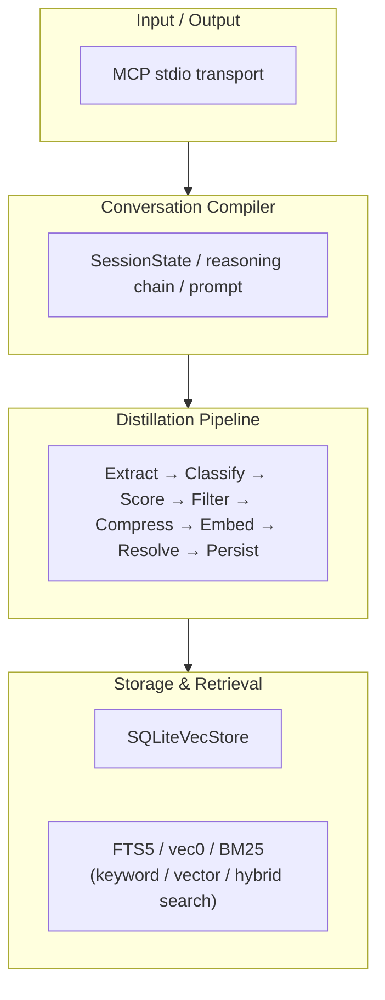
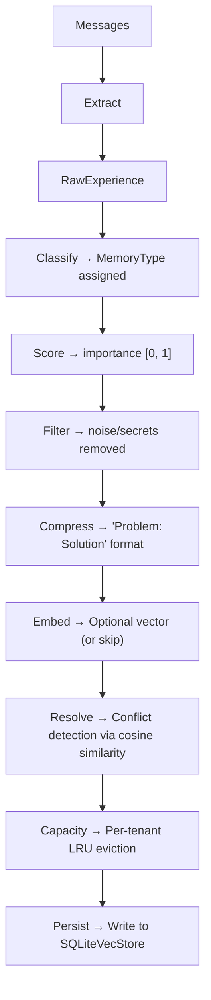
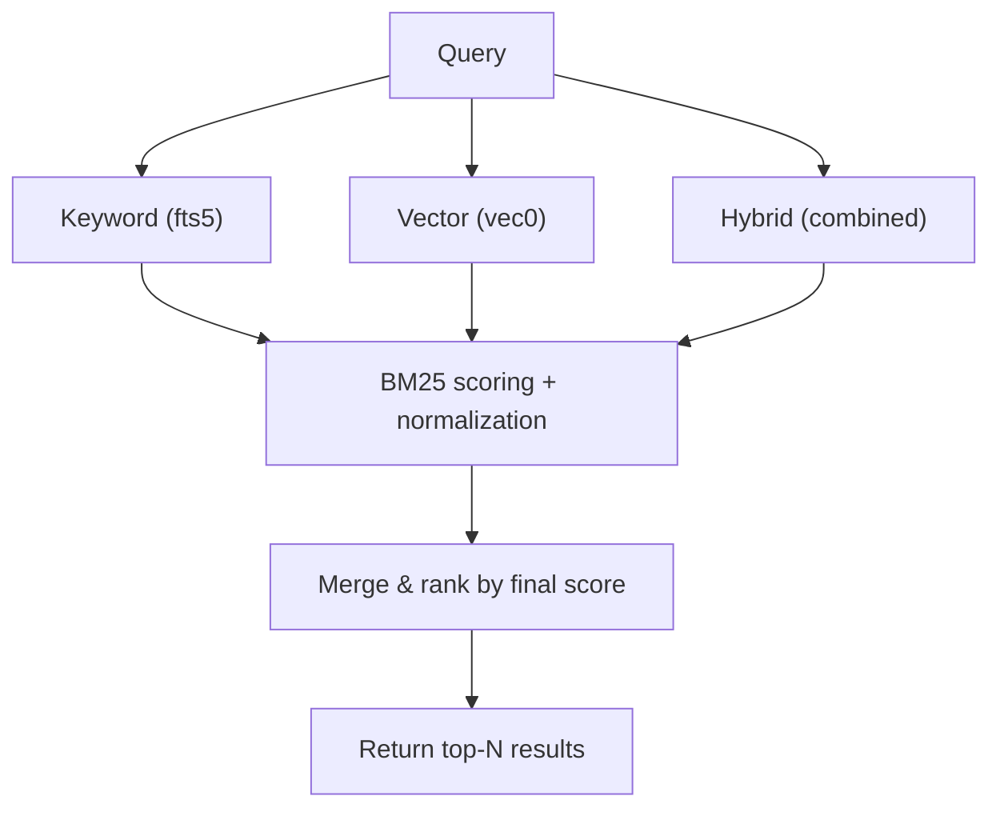
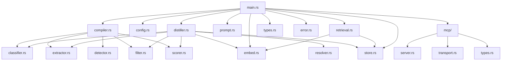

# Architecture

## Overview

The Memory Distillation server is organized into four major subsystems connected by a data pipeline:

## Subsystems

### 1. MCP Transport Layer

**Files**: `src/mcp/mod.rs`, `src/mcp/server.rs`, `src/mcp/transport.rs`, `src/mcp/types.rs`

The server implements the [Model Context Protocol](https://modelcontextprotocol.io/) over stdio transport. It supports three JSON-RPC 2.0 methods:

| Method | Purpose |
|---|---|
| `initialize` | Protocol handshake, returns server name and version |
| `tools/list` | Returns the list of all registered tools with their input schemas |
| `tools/call` | Invokes a named tool with provided arguments |

The transport layer is abstracted behind a `Transport` trait, making it possible to add alternative transports (e.g., TCP, WebSocket) without changing the server logic.

**Key types**:
- `MCPServer` — Main server that dispatches JSON-RPC requests
- `ServerBuilder` — Builder pattern for registering tools and configuring the server
- `ToolHandler` — Async trait for tool implementations
- `StdioTransport` — Reads JSON-RPC from stdin, writes to stdout

### 2. Conversation Compiler

**Files**: `src/compiler.rs`, `src/prompt.rs`

The `ConversationCompiler` analyzes raw conversation messages to build a structured `SessionState`. It runs **before** the distillation pipeline and produces:

| Component | Description |
|---|---|
| `current_goal` | The first user message (assumed to be the session goal) |
| `current_module` | Detected module name from file paths in the conversation |
| `current_files` | Files mentioned during the session |
| `open_problems` | User questions that received no assistant answer |
| `knowledge` | Memories extracted from problem-solution pairs |
| `decisions` | Construction decisions detected via `DONE` / `DECIDED` / `CHOSEN` markers |
| `reasoning_chain` | Full reasoning trace including tool invocations |

The `PromptBuilder` then compiles this state into a structured prompt text for the next session, including:

- Top 5 knowledge items by importance
- Top 3 decisions
- Session state summary (goal, module, files, open problems)
- Reasoning chain
- Last 3 recent messages (trimmed to 200 characters)

### 3. Distillation Pipeline

**Files**: `src/distiller.rs`, `src/extractor.rs`, `src/classifier.rs`, `src/scorer.rs`, `src/filter.rs`, `src/resolver.rs`, `src/embed.rs`

The core of the system — an 8-stage pipeline. See [distillation-pipeline.md](distillation-pipeline.md) for exhaustive detail.

### 4. Storage & Retrieval

**Files**: `src/store.rs`, `src/retrieval.rs`

See [storage-retrieval.md](storage-retrieval.md) for exhaustive detail.

## Data Flow

### Distillation Flow

### Retrieval Flow

## Module Dependency Map

## Key Design Decisions

1. **sqlite-vec over standalone vector DBs** — Simplifies deployment: a single SQLite file holds everything (metadata, FTS5 index, vector index). No separate vector database process.

2. **Keyword-first, vector-optional** — The system works fully with zero embedding costs. Vector search is purely additive.

3. **Deterministic classification** — No LLM calls during distillation. Classification uses keyword scoring. This makes the pipeline fast, cheap, and testable.

4. **Compiled sessions** — The `ConversationCompiler` captures session state before distillation, enabling rich context injection on the next session without re-analyzing history.

5. **Per-tenant capacity with LRU eviction** — Each tenant has independent capacity limits by memory type, enforced via LRU eviction to prevent unbounded growth.
