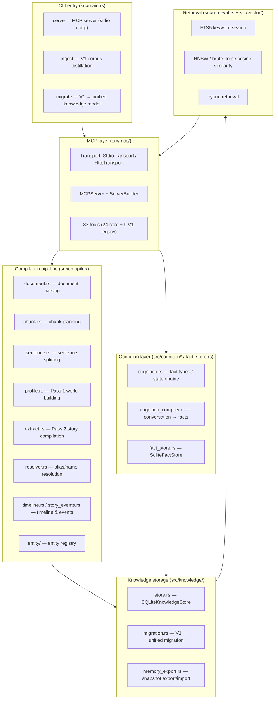
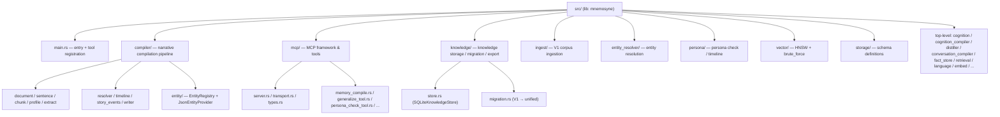
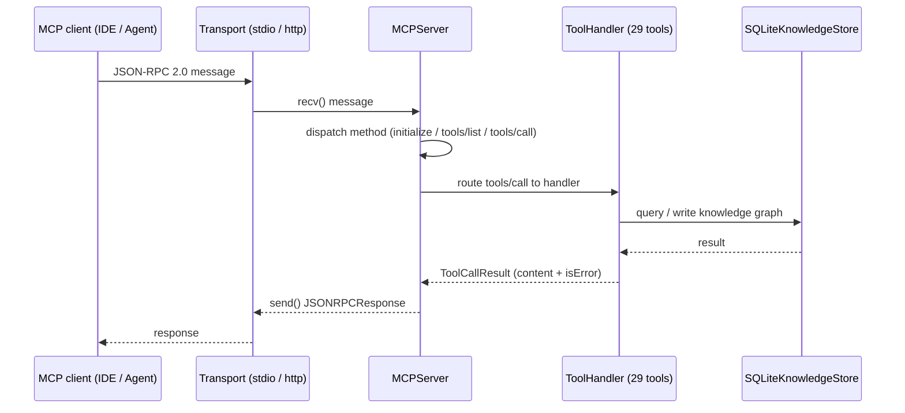
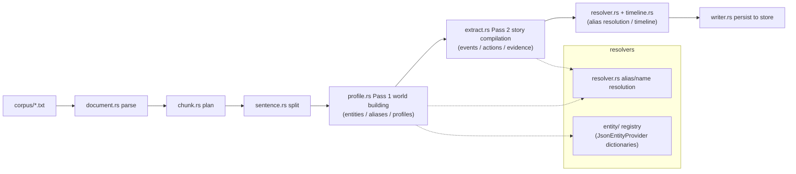
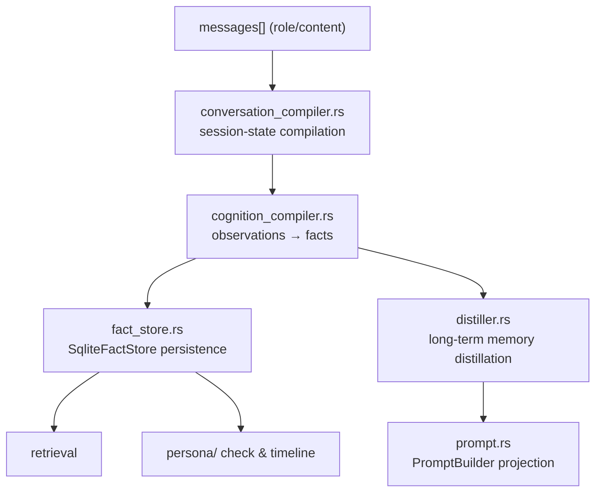
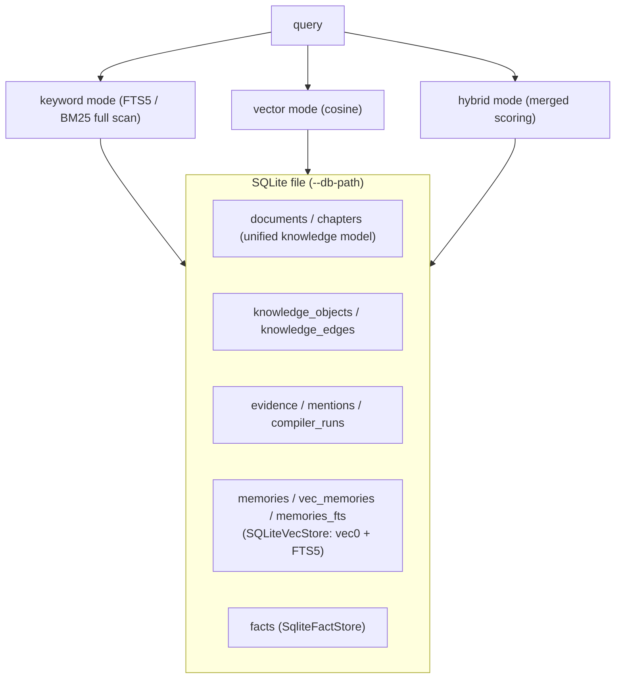
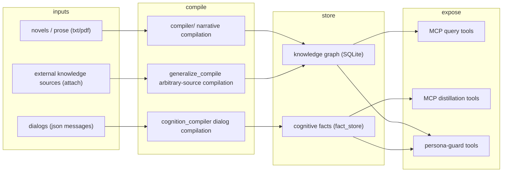

# Mnemosyne System Architecture

> This document **faithfully** describes the current codebase (`src/`) as it
> actually is. All diagrams are mermaid. Identifiers and paths follow the code;
> prose is in English.

## 1. Overview

Mnemosyne is an **LLM-free knowledge distillation engine + MCP server**: it
compiles narrative text (novels / dialogs / prose) into a unified knowledge
model (documents → entities → events → relations → evidence), persists it to a
single SQLite file, and exposes query / distillation / persona-guard tools over
the MCP protocol.

## 2. Module structure (actual directory tree)

## 3. MCP server architecture

**Transport layer** (`Transport` trait):

| Implementation | Use case | Key points |
|---|---|---|
| `StdioTransport` | local IDE integration | line-delimited JSON-RPC over stdin/stdout |
| `HttpTransport` | remote serving | per-session SSE isolation (`x-mcp-session-id`), mandatory `--http-token` auth, constant-time comparison |

## 4. Narrative compilation pipeline (compiler/)

**Entity providers** (`config/entity_profiles/*.json`): `sanguo` / `shuihu` /
`honglou` / `xiyou` / `fengshen` / `warandpeace` — canonical names and aliases
per novel.

## 5. Conversation → cognition (cognition layer)

**Fact types** (`cognition.rs`): Identity / Preference / Goal / Event /
Relationship / Emotion — each fact carries an evidence chain (EvidenceRef),
immutable and traceable.

## 6. Storage & retrieval

| Component | Implementation | Notes |
|---|---|---|
| `SQLiteKnowledgeStore` | `knowledge/store.rs` | unified knowledge model CRUD (documents/objects/edges/evidence), transactional, FK-managed |
| `SQLiteVecStore` | `store.rs` | memory storage: `vec0` vector table + `memories_fts` FTS5 table; pure keyword when `MEMORY_VECTOR_DIM=0` |
| `SqliteFactStore` | `fact_store.rs` | cognitive fact persistence |
| `RetrievalEngine` | `retrieval.rs` | retrieval orchestration: `keyword` (FTS5/BM25), `vector` (cosine), `hybrid` (weighted merge) |
| BM25 scoring | `retrieval.rs::bm25_score` | simplified BM25 variant (k1=1.2 only, no length normalization), `tanh`-normalized to [0,1] |
| Vector search | `vector/` HNSW / brute_force | cosine similarity; zero vector → `sqrt(2)` (cosine=0.0) |

## 7. End-to-end data flow

## 8. Key design decisions (as implemented)

1. **LLM-free core** — compilation, distillation, retrieval and persona checks
   are all deterministic algorithms (Aho-Corasick verb matching, bigram-Jaccard
   similarity, cosine vector search, rule scoring). Zero API-key dependency,
   reproducible behavior.
2. **Single SQLite file** — metadata, FTS5 index, vector index and cognitive
   facts live in one place; deployment is one file.
3. **Keyword-first, vector optional** — fully usable at zero embedding cost
   with `MEMORY_VECTOR_DIM=0`.
4. **Dual-transport MCP** — stdio for local IDEs, HTTP+SSE for remote
   (session isolation + mandatory auth + file allowlist).
5. **Two stores with clear roles** — `SQLiteKnowledgeStore` (narrative
   knowledge graph) and `SqliteFactStore` (dialog cognitive facts), bridged by
   tools such as `story_bridge`.
6. **V1 legacy preserved** — `character_*` tables remain a read-only view;
   `migrate` moves them into the unified knowledge model.

## 9. Related documents

- [Distillation pipeline](distillation-pipeline.md)
- [Storage & retrieval](storage-retrieval.md)
- [MCP tools](mcp-tools.md)
- [Configuration](configuration.md)
- [Getting started](getting-started.md)
- [Development](development.md)
