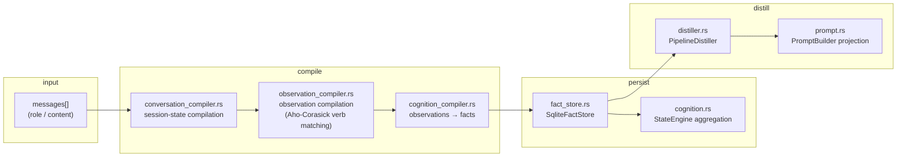
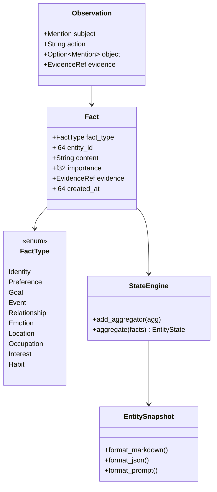
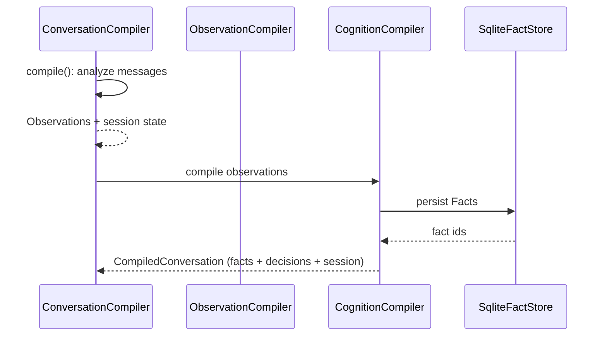

# Module: Cognition Layer (conversation → facts → distillation)

> This document faithfully describes the cognition modules: `cognition.rs`,
> `conversation_compiler.rs`, `cognition_compiler.rs`, `fact_store.rs`,
> `distiller.rs`, `prompt.rs`. What they do, how they work, and **why they are
> designed this way** (technical decisions). All diagrams are mermaid.

## 1. Overview

The cognition layer is Mnemosyne's **conversation-intelligence core**: it
compiles a conversation (messages) into **structured cognitive state** (facts /
decisions / session state), persists it to `SqliteFactStore`, and optionally
distills long-term memories. It powers `memory_compile` /
`memory_context_check` MCP tools and companion-AI persona stability
(`persona_check` / `persona_timeline`).

## 2. Core types (cognition.rs)

| Type | Responsibility |
|---|---|
| `Observation` | compile intermediate: subject + action + object + evidence ref |
| `Fact` | immutable fact: type + entity + content + importance + evidence chain |
| `FactType` | Identity / Preference / Goal / Event / Relationship / Emotion / Location / Occupation / Interest / Habit (10) |
| `EvidenceRef` | evidence-chain reference (traceable to source text) |
| `StateEngine` | aggregate facts → entity state (`EntityState`) |
| `EntitySnapshot` | snapshot output: Markdown / JSON / Prompt |
| `CognitiveContext` | structured cognitive context for the AI |

## 3. Compile flow (conversation → facts)

- `conversation_compiler.rs::compile()` produces `CompiledConversation`
  (facts + decisions + session state + reasoning chain).
- `compile_user_observations` / `compile_user_facts` / `user_facts_from_memories`
  derive user facts from messages, observations, and existing memories.

## 4. Technical decisions (why)

### 4.1 Why "facts from compilation" instead of LLM summarization?

**Decision**: `Observation → Fact` is fully rule-driven
(`observation_compiler.rs` matches actions via Aho-Corasick verb tables;
`cognition_compiler.rs` assembles facts).

**Why**:
- **Traceable**: every `Fact` carries an `EvidenceRef` to source text — "where
  did this knowledge come from" is always answerable; an LLM cannot.
- **Reproducible**: the same conversation compiles identically every time —
  tests lock behavior.
- **Immutable**: once persisted, facts are never edited (only decayed/archived),
  keeping the cognitive history complete.

### 4.2 Why immutable facts with decay instead of deletion?

**Decision**: `SqliteFactStore` provides `set_decay` (down-weight + archive);
`memory_decay` calls it; `list_archived` keeps records; **facts are never
physically deleted**.

**Why**: a companion AI's persona evolution timeline (`persona_timeline`) is
rebuilt from complete history — deleting destroys evolution evidence. Decay
keeps the record while lowering weight.

### 4.3 Why two separate stores (`FactStore` vs `KnowledgeStore`)?

**Decision**: cognitive facts live in `SqliteFactStore` (facts table); narrative
knowledge in `SQLiteKnowledgeStore` (documents/objects/edges); they never mix.

**Why**:
- **Different roles**: the knowledge graph is the "world model" (facts about the
  narrative world); the fact store is "conversation cognition" (long-term user/
  agent state). Mixing them muddies query semantics.
- **Explicit bridge**: `story_bridge` converts between the two — a visible
  adapter, not implicit sharing.

### 4.4 Why the `StateEngine` aggregator pattern?

**Decision**: `StateAggregator` trait (e.g. `EmotionAggregator`) registers into
`StateEngine`; `aggregate(facts)` yields `EntityState`.

**Why**: each dimension (emotion, goals, preferences) has its own aggregation
rules — pluggable and testable instead of one giant aggregation function.

### 4.5 Why optional distillation (`Option<PipelineDistiller>`)?

**Decision**: `MemoryCompileTool` holds `distiller: Option<Arc<PipelineDistiller>>`;
without it only facts compile; with it, long-term memories are distilled too.

**Why**: distillation is an enhancement, not a requirement — lightweight
scenarios (structured cognition only) skip its overhead; long-term memory turns
it on via configuration.

## 5. Deep dive

### 5.1 `SqliteFactStore` (fact_store.rs)

- `resolve_entity` / `resolve_user` / `resolve_agent`: resolve-or-create
  entities by external key.
- `find_entity`: pure read-only lookup (used by MCP read-only diagnostic paths
  to avoid unintended writes).
- Fact CRUD + `set_decay` / `list_archived` / `get_decay` (decay support).
- `open` / `open_in_memory`: file and in-memory stores (tests).

### 5.2 `PipelineDistiller` (distiller.rs)

8-stage pipeline (extract → classify → score → filter → compress → embed →
resolve → persist); `DistillationConfig` controls stages; `compress_pair`
compresses problem/solution pairs into memory entries; `MetricsSnapshot`
exposes distillation metrics.

### 5.3 `PromptBuilder` (prompt.rs)

Projects facts + decisions + session state into a structured prompt:
importance-ranked knowledge list, decision records, session goal/module/open
problems, reasoning chain, recent messages — injected into the next turn.

## 6. Related

- [System architecture](../en/architecture.md)
- [Knowledge storage](knowledge.md)
- [MCP framework](mcp.md)
- [Retrieval](retrieval.md)
