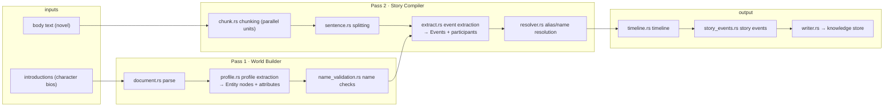

# Module: Narrative Compilation Pipeline (src/compiler/)

> This document faithfully describes `src/compiler/`: what it does, how it is
> implemented, and **why it is designed this way** (technical decisions).
> All diagrams are mermaid.

## 1. Overview

`compiler/` is Mnemosyne's **world-model compiler** (V7): it turns unstructured
narrative text (introductions + novel body) into an **entity-centric world
model** (entity nodes + events + relations + evidence) for later knowledge-graph
queries and AI-agent reasoning.

Unlike an LLM pipeline, **compilation is 100% LLM-free** — deterministic rules
+ dictionaries (`JsonEntityProvider`) + statistics. Behavior is reproducible,
testable, and traceable.

## 2. Pipeline overview

## 3. Files (actual)

| File | Responsibility |
|---|---|
| `mod.rs` | module root: V7 pipeline declaration, Chunk/Sentence/ID shared IR |
| `document.rs` | document parsing (corpus file → structured text) |
| `chunk.rs` | chunking: text → **parallel compilation units** |
| `sentence.rs` | sentence splitting: Chunk → Sentences |
| `profile.rs` | Pass 1 world building: entity profiles from bios |
| `extract.rs` | Pass 2 story compilation: `Config::from_language()` + `compile()` |
| `resolver.rs` | alias/name resolution (multi-name characters) |
| `name_validation.rs` | entity name validity checks |
| `timeline.rs` | timeline construction (chapter ordering, relation windows) |
| `story_events.rs` | story-event model (cross-character aggregation) |
| `faction.rs` | faction/group affiliation |
| `pipeline.rs` | pipeline orchestration + `PipelineStats` |
| `writer.rs` | persist compiled output to the knowledge store |

## 4. Technical decisions (why)

### 4.1 Why Pass 1 / Pass 2 instead of a single scan?

**Decision**: first "world building" (entities from bios), then "story
compilation" (events/relations from body text).

**Why**:
- **Dictionary first**: Pass 1 produces the entity set and alias table
  (`resolver.rs`), so Pass 2 resolves participants against *known* entities —
  "who is a protagonist" is settled before event extraction.
- **Alias quality**: multi-name characters (曹操 = 孟德) must be registered
  first, or variant names would become separate entities. Pass 1 profiles
  provide aliases (courtesy_name/title).
- **Verifiability**: the entity set can be asserted by tests before story
  compilation proceeds.

### 4.2 Why chunk instead of compiling the whole text at once?

**Decision**: `chunk.rs` splits the body into chunks; `sentence.rs` splits per
chunk.

**Why**:
- **Parallelism**: each chunk is an independent compilation unit
  ("parallel compilation unit" in code) — long novels (84k sentences) don't
  serialize.
- **Bounded memory**: a 3.3 MB novel is never loaded whole into analysis state;
  peak memory is bounded by chunk size.
- **Failure isolation**: one bad chunk doesn't kill the whole compile.

### 4.3 Why rules + dictionaries instead of an LLM?

**Decision**: event extraction (`extract.rs`) is driven by a language provider
(`Config::from_language(&dyn LanguageProvider)`); entity recognition by
`JsonEntityProvider` dictionaries (`config/entity_profiles/*.json`).

**Why**:
- **Zero API dependency**: local computation, no cost, no network failure mode.
- **Reproducible**: identical corpus → byte-identical output every run — the
  precondition for regression tests (`sanguo_compile`,
  `generalize_corpus_regression`).
- **Traceable**: every event/relation points back to source sentences
  (EvidenceRef) — an LLM cannot give that guarantee.

### 4.4 Why `LanguageProvider` abstraction?

**Decision**: `EnglishLanguageProvider` and Chinese providers implement the
same trait; `extract::Config::from_language()` assembles verbs/patterns from it.

**Why**: one pipeline handles both languages without hard-coding any language
feature — verb matching (Aho-Corasick), syntax rules, and entity naming all
switch with the provider. The four classics (zh) and War and Peace (en) share
one code path.

## 5. Deep dive

### 5.1 Pass 1 · World Builder

Input: character bios (introductions). `profile.rs` extracts per bio:

- entity nodes and types
- attribute profiles (courtesy_name, title, origin, personality, …)
- alias registration (into `resolver.rs` alias → canonical map)

`name_validation.rs` filters invalid names (too short, pure punctuation, noise)
to keep the entity set clean.

### 5.2 Pass 2 · Story Compiler

Body text flows `chunk.rs → sentence.rs`, then `extract.rs::compile()` per
sentence:

1. match actions via language rule verb tables (Aho-Corasick multi-pattern)
2. resolve participants (Pass 1 entity table + `resolver.rs` aliases)
3. emit events (action + participants + time + evidence ref)
4. `timeline.rs` builds the timeline; `story_events.rs` aggregates
   cross-character events

### 5.3 Output

`writer.rs` persists Entity / Event / Relation / Evidence into
`SQLiteKnowledgeStore`, queried later by `inspect_entity` / `timeline` /
`relation_graph` MCP tools.

## 6. Related

- [System architecture](../en/architecture.md)
- [Knowledge storage](knowledge.md)
- [Retrieval](retrieval.md)
