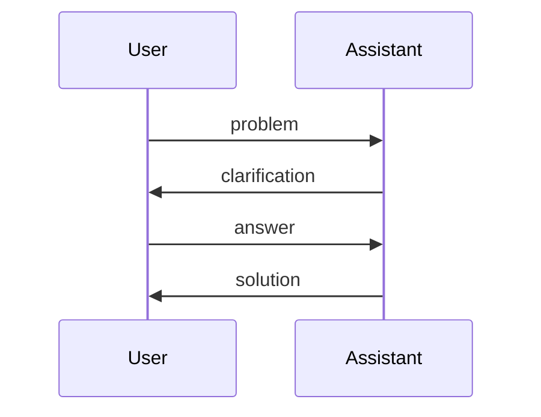
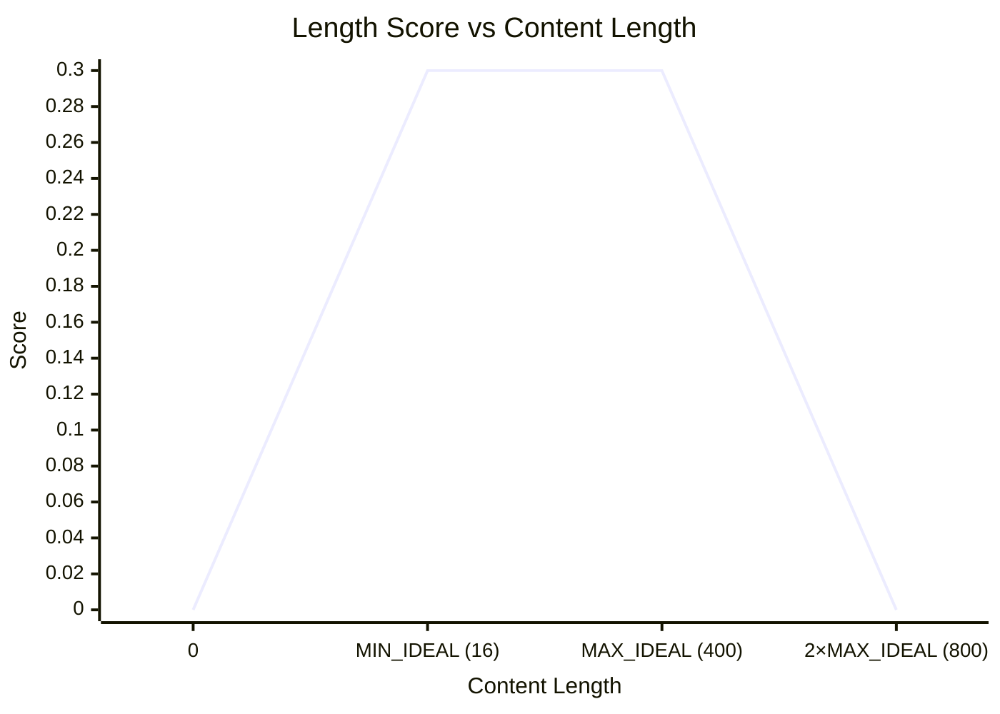
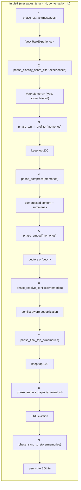

# Distillation Pipeline

The distillation pipeline is the heart of the system — an 8-stage process that transforms raw conversation messages into structured, persistent memories. Each stage is deterministic, independently testable, and separated by clear data boundaries.

## Pipeline Overview


The pipeline is orchestrated by `PipelineDistiller` in `src/distiller.rs`.

## Stage 1: Extract

**File**: `src/extractor.rs`  
**Type**: `ExperienceExtractor`

Extracts problem-solution pairs from a conversation message stream. Two extraction modes work in tandem:

### Direct Extraction

For each user message that `QuestionDetector` (in `src/detector.rs`) identifies as a **problem** (contains a question mark `?` or interrogative keywords like "how", "what", "why", "can", "does"), the extractor pairs it with the immediately following assistant response.

**Heuristics** — an `is_problem` check looks for:
- A question mark `?` in the content
- Keywords: "how to", "how do", "what is", "why", "can you", "does"

If the user message is not a problem, the pair is skipped.

### Cross-Turn Extraction

When enabled via `ExtractorConfig`, the extractor builds 4-message arcs spanning multiple turns:



This captures interactions where the user answers their own clarifying question before the assistant gives a final answer.

**Output**: `Vec<RawExperience>` — each containing a `problem` and `solution` string, an `ExtractionMethod` (Direct or CrossTurn), and the source `conversation_id`.

## Stage 2: Classify

**File**: `src/classifier.rs`  
**Type**: `MemoryClassifier`

Assigns a `MemoryType` to each problem-solution pair using lightweight keyword scoring:

| MemoryType | Example Keywords | Meaning |
|---|---|---|
| `Knowledge` | "how to", "error", "fix", "cause", "solution" | Technical know-how, bug fixes |
| `Skill` | (reserved, currently grouped with Knowledge) | Procedural capabilities |
| `Preference` | "prefer", "always use", "convention", "style" | User preferences and conventions |
| `Experience` | (context-bound lessons) | Situational lessons learned |
| `Profile` | "i am", "my name", "i work", "i use" | User identity and background |
| `Interaction` | "today", "yesterday", "this session" | Transient, time-bound utterances |

**Algorithm**:
1. Concatenate `problem` + `solution` and lowercase
2. Count substring matches against a hand-curated keyword list per type
3. Pick the type with the most matches; tie-break by array order
4. If no keyword matched anywhere, default to `Knowledge`

**Deterministic**: Same input always yields the same classification.

## Stage 3: Score

**File**: `src/scorer.rs`  
**Type**: `ImportanceScorer`

Assigns an importance score in `[0.0, 1.0]` combining three signals:

### Signal Weights

| Signal | Weight | Description |
|---|---|---|
| `BASE_SCORE` | 0.10 | Every memory starts with this baseline |
| `KEYWORD_WEIGHT` | 0.08 per match (max 6) | High-value keywords: error, crash, security, migration, etc. |
| `LENGTH_WEIGHT` | 0.30 | Sweet-spot length (16–400 chars) scores max |
| `TYPE_WEIGHT` | 0.40 × type_bias | Knowledge (0.95) > Profile (0.85) > Experience (0.70) > Preference (0.65) > Interaction (0.40) |

### Length Score Curve



### Formula

```text
score = BASE_SCORE + keyword_score + length_score + (type_bias × TYPE_WEIGHT)
result = clamp(score, 0.0, 1.0)
```

## Stage 4: Filter

**File**: `src/filter.rs`  
**Types**: `NoiseFilter`, `SecurityFilter`

Two independent filters remove low-quality and dangerous content before storage.

### NoiseFilter

Rejects messages that are:
- **Too short**: fewer than `MIN_MEANINGFUL_LENGTH` (8) characters
- **Too long**: more than `MAX_MESSAGE_LENGTH` (8,000) characters
- **Chatter**: matches known casual phrases like "got it", "thanks", "sure", "ok", "let me know", "you're welcome"

The `retain_indices` method returns a boolean mask, preserving the message ordering.

### SecurityFilter

Detects sensitive content using regex patterns for:
- API keys (`sk-...`, `pk-...`)
- AWS access keys (`AKIA...`)
- GitHub tokens (`ghp_...`, `gho_...`, `github_pat_...`)
- Bearer tokens, JWT tokens
- Custom patterns (extensible via `with_patterns`)

**Design**: Filtering is conservative — any match discards the entire message. Better to lose a borderline memory than leak a secret.

## Stage 5: Compress

**File**: `src/distiller.rs` (function `compress_pair`)

Compresses the problem-solution pair into a standardized string format:

```
问题：<problem truncated to 60 chars>
解决方案：<solution truncated to 120 chars>
```

**Truncation**: Character-safe (handles multi-byte UTF-8 by truncating at the grapheme boundary).

**Bidirectional**: The format is both human-readable and machine-parseable.

## Stage 6: Embed

**File**: `src/embed.rs`  
**Types**: `EmbeddingService` trait, `NullEmbedder`, `RemoteEmbedder`

Optionally converts the compressed memory into a vector embedding.

### Embedding Providers

| Provider | Behavior |
|---|---|
| `none` (NullEmbedder) | Returns empty vectors; `enabled() == false`. Retrieval falls back to keyword-only mode. Zero API cost. |
| `openai` (RemoteEmbedder) | HTTP POST to OpenAI-compatible `/embed` endpoint. Requires `MEMORY_OPENAI_API_KEY`. |
| `ollama` (RemoteEmbedder) | Same interface, pointing at a local Ollama instance. |

### EmbeddingService Trait

```rust
#[async_trait]
pub trait EmbeddingService: Send + Sync {
    async fn embed(&self, text: &str) -> Result<Vec<f32>>;
    async fn embed_with_prefix(&self, text: &str, prefix: &str) -> Result<Vec<f32>>;
    async fn embed_batch(&self, texts: &[String]) -> Result<Vec<Vec<f32>>>;
    async fn health_check(&self) -> Result<()>;
    fn model(&self) -> &str;
    fn timeout(&self) -> Duration;
    fn enabled(&self) -> bool;
}
```

**Note**: `embed_batch` currently iterates sequentially. Override with a batched HTTP call when the upstream supports it.

## Stage 7: Resolve

**File**: `src/resolver.rs`  
**Type**: `ConflictResolver`

Detects and resolves semantic conflicts between new and existing memories using **cosine similarity** on their vector embeddings.

### Algorithm

1. For each incoming memory, compare its vector against all existing memories of the same `MemoryType` and `tenant_id`
2. If `cosine_similarity(a, b) >= threshold` (default: 0.92), it's a conflict
3. **Resolution**:
   - If the new memory has higher importance → **replace** the old one
   - If the new memory has lower or equal importance → **keep both** (semantic diversity is preserved)
4. Memories without vectors (keyword mode) skip conflict detection — both are stored

### Cosine Similarity

```rust
pub fn cosine_similarity(a: &[f32], b: &[f32]) -> Option<f64>
```

Returns `None` if dimensions differ or either vector is zero-magnitude.

## Stage 8: Capacity

**File**: `src/distiller.rs` (`phase_enforce_capacity`)

Enforces per-tenant, per-type capacity limits using LRU eviction.

| Parameter | Default | Description |
|---|---|---|
| `max_memories_per_type` | 5000 | Max memories of each `MemoryType` per tenant |
| Eviction policy | LRU | Least recently updated memories are evicted first |

**Tenant isolation**: Each tenant's capacity is tracked independently, so one tenant cannot crowd out another.

## Metrics

The `PipelineDistiller` exposes real-time metrics through `DistillationMetrics`:

| Metric | Description |
|---|---|
| `extracted_count` | Raw pairs extracted from messages |
| `classified_count` | Pairs that passed classification |
| `scored_count` | Pairs that passed scoring and exceeded `min_importance` |
| `filtered_count` | Pairs removed by noise/security filters |
| `compressed_count` | Pairs after compression |
| `embedded_count` | Pairs successfully embedded |
| `conflicts_detected` | Pairs that conflicted with existing memories |
| `conflicts_replaced` | Conflicts where the new memory replaced the old |
| `stored_count` | Final count written to the database |
| `rejected_low_importance` | Pairs below `min_importance` |
| `errors_count` | Pipeline errors encountered |

## Configuration

| Parameter | Default | Effect |
|---|---|---|
| `min_importance` | 0.6 | Skip memories below this score |
| `enable_cross_turn` | true | Enable 4-message arc extraction |
| `max_memories_per_distillation` | 3 | Max memories produced per distillation call |
| `max_solutions_per_tenant` | 5000 | Max `Knowledge` memories per tenant |
| `conflict_threshold` | 0.85 | Cosine similarity threshold for conflict detection |

## Complete Pipeline Sequence


