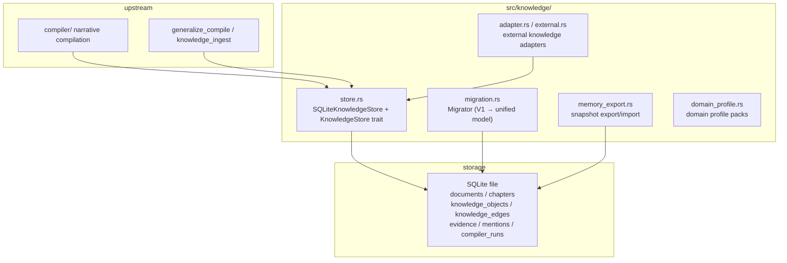

# Module: Knowledge Storage Layer (src/knowledge/)

> This document faithfully describes `src/knowledge/`: what it does, how it is
> implemented, and **why it is designed this way** (technical decisions).
> All diagrams are mermaid.

## 1. Overview

`knowledge/` is Mnemosyne's **persistence layer**: it stores the compiled world
model (documents / entities / relations / evidence) in SQLite and provides
CRUD, migration, snapshot export/import, and external-knowledge adapters. It is
the data foundation for the retrieval layer and MCP tools.



## 2. Files (actual)

| File | Responsibility |
|---|---|
| `store.rs` | `SQLiteKnowledgeStore` (core CRUD) + `KnowledgeStore` trait + transaction/FK management |
| `migration.rs` | `Migrator`: V1 `character_*` tables → unified knowledge model |
| `memory_export.rs` | knowledge-graph snapshot serialization (ExportBundle) and import |
| `adapter.rs` / `external.rs` | external knowledge source adapters (docs/dictionaries/DBs) |
| `entity_linker.rs` | cross-source entity linker (external surface names → unified nodes) |
| `companion_extract.rs` | companion-scenario entity extraction |
| `document_source.rs` | unified document source abstraction (`DocumentSource` trait) |
| `domain_profile.rs` | `DomainProfile`: compilation configuration packs |
| `key_events.rs` | key-event distillation logic |
| `pdf.rs` | PDF corpus parsing |
| `format.rs` | format detection |
| `mod.rs` | module exports |

## 3. Core model

```mermaid
erDiagram
    documents ||--o{ chapters : contains
    documents ||--o{ knowledge_objects : contains
    documents ||--o{ evidence : contains
    knowledge_objects ||--o{ knowledge_edges : source
    knowledge_objects ||--o{ knowledge_edges : target
    knowledge_objects ||--o{ mentions : has
    chapters ||--o{ mentions : locates
    knowledge_objects ||--o{ evidence : linked
    knowledge_edges ||--o{ evidence : linked

    documents { int id PK }
    chapters { int id PK, int doc_id FK, int chapter_no }
    knowledge_objects { int id PK, int doc_id FK, text object_type, text name }
    knowledge_edges { int id PK, int source_id FK, int target_id FK, text predicate }
    evidence { int id PK, int doc_id FK, text content }
    mentions { int id PK, int object_id FK, int chapter_id FK }
    compiler_runs { int id PK, int doc_id FK }
```

## 4. Technical decisions (why)

### 4.1 Why a `KnowledgeStore` trait?

**Decision**: `trait KnowledgeStore: Send + Sync` defines the domain interface;
`SQLiteKnowledgeStore` implements it. MCP tools and compilers depend only on
the trait.

**Why**:
- **Swap freedom**: tests use an in-memory implementation (`open_in_memory`);
  other backends are possible later with zero caller changes.
- **Interface as documentation**: domain operations (create_document /
  create_object / create_edge / search_evidence / inspect_entity ...) live in
  the trait — reading the interface reveals the capabilities.

### 4.2 Why wrap writes in transactions?

**Decision** (`store.rs`): `begin_transaction` / `commit_transaction` /
`rollback_transaction`; bulk operations (`clear_all` / `clear_for_document`)
run inside a transaction with `PRAGMA foreign_keys` outside it.

**Why**:
- **Atomicity**: a multi-table DELETE failing midway leaves a half-wipe plus FK
  permanently OFF (fixed bug); the transaction rolls back atomically.
- **FK integrity**: `PRAGMA foreign_keys` is a no-op inside a transaction and
  must be set outside.

### 4.3 Why keep V1 tables as a read-only view and migrate?

**Decision** (`migration.rs`): `character_*` tables are never dropped;
`Migrator::migrate()` migrates them plus corpus text into the unified model.

**Why**:
- **No data destruction**: V1 is legacy; the read-only view keeps old tools
  working.
- **Idempotent rebuild**: migration re-runs safely (reuses documents by title,
  clears before writing) — a clean rebuild, not an accumulating append.
- **Transactional**: `migrate()` wraps the whole run in an H6 transaction —
  failure rolls back everything. V1 data is **preloaded as a snapshot before**
  the transaction to avoid lock contention between the two connections
  (v1/knowledge on the same file).

### 4.4 Why snapshot export/import (memory_export)?

**Decision** (`memory_export.rs`): `ExportBundle` serializes the whole graph;
`memory_export` / `memory_import` tools back it up and restore it.

**Why**: the "memory is never lost" guarantee — persona memory can be moved
between machines, backed up, shared and restored intact.

### 4.5 Why a `DocumentSource` trait?

**Decision** (`document_source.rs`): `RawTextSource` (text) and `DialogSource`
(dialog messages) implement one trait consumed by `compile_source()`.

**Why**: `generalize_compile` compiles "any source" with one tool — prose via
text, conversations via dialog, external docs via attach — reusing the
compilation pipeline instead of duplicating it.

## 5. Deep dive: key operations

### 5.1 `SQLiteKnowledgeStore::open` (idempotent schema)

Opens the SQLite file and creates all tables with `CREATE TABLE IF NOT EXISTS`
(V7 unified model); `open_in_memory()` supports tests. FK enforcement is on by
default; busy_timeout prevents deadlock under concurrency.

### 5.2 `KnowledgeStore` trait highlights

| Method | Purpose |
|---|---|
| `create_document` / `find_document_by_title` | document lifecycle |
| `create_chapter` | chapters (with byte offsets) |
| `create_object` / `create_edge` | entities and relations |
| `create_evidence` / `link_evidence` | evidence and links |
| `create_mention` | character–chapter mentions |
| `create_run` / `finish_run` | compiler-run tracing |
| `inspect_entity` / `search_evidence` / `search_objects` | queries (portraits/evidence/objects) |
| `clear_all` / `clear_for_document` | wipe all / per-document (transactional) |

## 6. Related

- [System architecture](../en/architecture.md)
- [Narrative compilation pipeline](compiler.md)
- [Retrieval](retrieval.md)
- [MCP framework](mcp.md)
