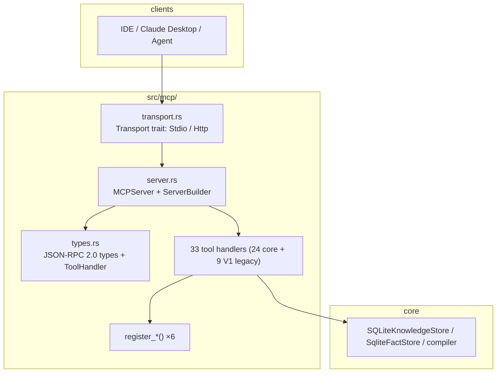
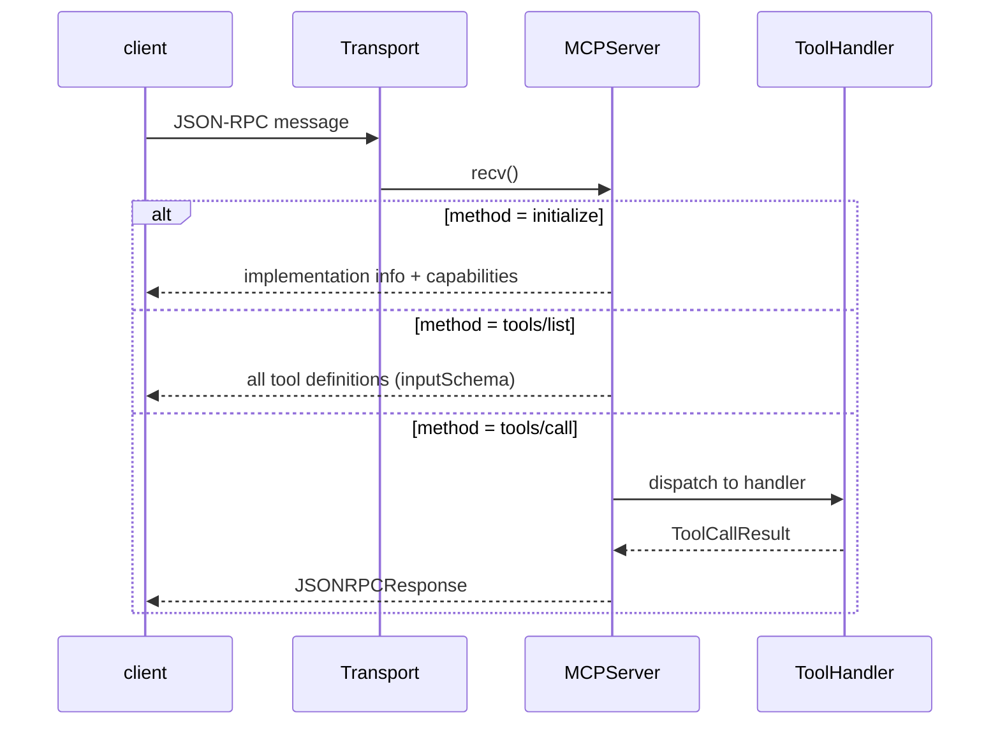
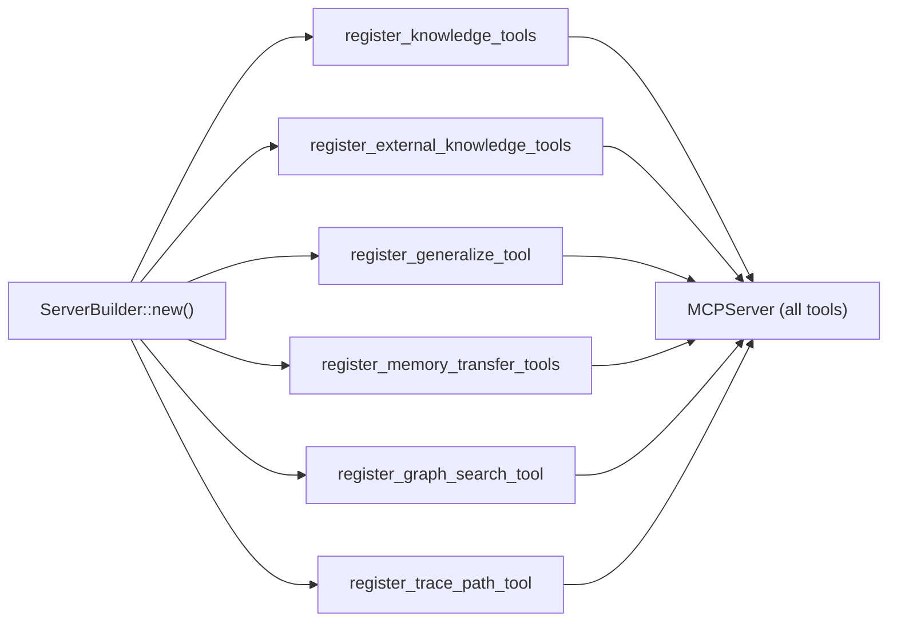

# Module: MCP Framework & Tools (src/mcp/)

> This document faithfully describes `src/mcp/`: what it does, how it is
> implemented, and **why it is designed this way** (technical decisions).
> All diagrams are mermaid.

## 1. Overview

`mcp/` is Mnemosyne's **external service layer**: a [Model Context Protocol](
https://modelcontextprotocol.io) JSON-RPC 2.0 server plus every exposed tool.
It is the only entry point between IDEs/agents and the knowledge engine —
clients discover and call tools via `initialize` / `tools/list` / `tools/call`.

## 2. Files (actual)

| File | Responsibility |
|---|---|
| `server.rs` | `MCPServer` (JSON-RPC dispatch), `ServerBuilder` (tool registration) |
| `transport.rs` | `Transport` trait + `StdioTransport` |
| `http_server.rs` | `HttpTransport` (HTTP+SSE), `AppState`, session isolation, auth |
| `sse.rs` | Server-Sent Events stream |
| `types.rs` | JSON-RPC 2.0 types, `ToolDefinition`, `ToolHandler` trait |
| `mod.rs` | module exports |
| `memory_compile.rs` | conversation → cognition-fact compilation tool |
| `context_aware.rs` | context-aware distillation (threshold-gated) |
| `generalize_tool.rs` | arbitrary source → knowledge graph compilation |
| `knowledge_tools.rs` | inspect_entity / timeline / relation_graph / correct_relation / cognitive_context |
| `graph_search_tool.rs` | search_graph structured search |
| `trace_path_tool.rs` | shortest relationship path (BFS) |
| `persona_check_tool.rs` / `persona_inject_tool.rs` | persona consistency guard / persona injection |
| `relationship_tool.rs` | relationship_update / query / persona_timeline |
| `story_bridge_tool.rs` | novel character → persona-fact bridge |
| `decay_tool.rs` | memory decay |
| `key_events_tool.rs` | key-event distillation |
| `memory_transfer_tools.rs` | memory_export / import (file allowlist) |
| `external_knowledge_tools.rs` | knowledge_attach / ingest / agent_fact_compile |
| `external_knowledge_tools_tests.rs` | external knowledge tool tests |

## 3. Core mechanisms

### 3.1 Request dispatch (MCPServer)

### 3.2 Tool registration (ServerBuilder)

## 4. Technical decisions (why)

### 4.1 Why standard MCP instead of a custom API?

**Decision**: implement the MCP spec (JSON-RPC 2.0 + initialize/tools/list/tools/call).

**Why**: MCP is the de-facto standard — Claude Desktop, Cursor, VS Code and
other hosts work out of the box, zero host-side adapter code. A custom REST
API would require per-client integration.

### 4.2 Why abstract the transport behind a `Transport` trait?

**Decision**: `Transport` trait (`recv`/`send`), implemented by
`StdioTransport` and `HttpTransport`; `MCPServer::serve(&mut dyn Transport)`
is transport-agnostic.

**Why**:
- **One server, two access modes**: stdio for local IDEs, HTTP+SSE for remote
  deployments — core unchanged.
- **Testability**: tests drive it through in-memory channels
  (`transport_round_trips_over_channels`).

### 4.3 Why session isolation + mandatory auth over HTTP?

**Decision** (`http_server.rs`):
- each client sends `x-mcp-session-id`; `AppState` keeps a
  `session_id → broadcast::Sender` map; `HttpTransport::send` routes replies
  to the session's own channel.
- HTTP refuses to start without `--http-token`; token comparison is
  constant-time (XOR full buffer).

**Why**:
- **Cross-talk was a protocol-level bug**: a single global broadcast pushed
  client A's replies to client B. Per-session channels isolate concurrent
  clients (High-severity fix).
- **HTTP is exposed to the network**: no auth = bare; constant-time compare
  prevents timing side channels leaking the token.

### 4.4 Why the `memory_transfer` path allowlist?

**Decision**: `memory_export/import` `path` goes through
`resolve_transfer_path` — absolute paths and `..` escapes are rejected; only
the `exports/` directory is writable.

**Why**: the MCP client is external input; an arbitrary path would expose the
host filesystem (security fix). The allowlist pins the blast radius to the
export directory.

### 4.5 Why `inputSchema` (camelCase)?

**Decision**: `ToolDefinition.input_schema` serializes as `inputSchema`.

**Why**: the MCP wire contract mandates camelCase; strict clients fetch the
field by spec name, so snake_case loses the schema (regression fixed against
codescope).

## 5. Deep dive: tool categories

| Category | Tools | Purpose |
|---|---|---|
| Conversation compile | `memory_compile`, `agent_fact_compile`, `memory_context_check` | conversation → facts/knowledge/session state |
| Knowledge compile | `generalize_compile`, `knowledge_attach`, `knowledge_ingest` | any source → knowledge graph |
| Knowledge query | `inspect_entity`, `timeline`, `relation_graph`, `search_graph`, `trace_path`, `evidence`, `correct_relation`, `cognitive_context`, `person_key_events` | graph retrieval & entity portraits |
| Persona guard | `persona_check`, `persona_inject`, `relationship_update`, `relationship_query`, `persona_timeline`, `story_bridge` | companion-AI persona stability |
| Memory maintenance | `memory_decay`, `memory_export`, `memory_import` | decay, backup, migration |

## 6. Related

- [System architecture](../en/architecture.md)
- [Knowledge storage](knowledge.md)
- [Retrieval](retrieval.md)
- [Cognition](cognition.md)
