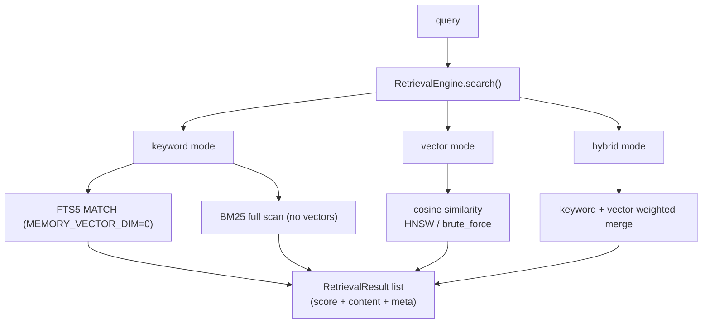

# Module: Retrieval Layer (src/retrieval.rs + src/vector/ + store search)

> This document faithfully describes the retrieval implementation: what it
> does, how it works, and **why it is designed this way** (technical
> decisions). All diagrams are mermaid.

## 1. Overview

The retrieval layer answers one question: **given a query, find the most
relevant results from memory and the knowledge base.** Three modes
(`RetrievalMode`): `keyword` (FTS5 / BM25), `vector` (cosine similarity), and
`hybrid` (weighted merge). It powers `memory_search`, `inspect_entity` evidence
queries, and `persona_check` semantic matching.

## 2. Core structures

| Type | File | Responsibility |
|---|---|---|
| `RetrievalEngine` | `retrieval.rs` | orchestration: mode selection, external registry, merged scoring |
| `RetrievalResult` | `retrieval.rs` | one result: score + content + metadata |
| `bm25_score` | `retrieval.rs` | simplified BM25 (k1=1.2 only, tanh-normalized) |
| `VectorIndex` trait | `vector/mod.rs` | vector-index abstraction |
| `HnswIndex` | `vector/hnsw.rs` | approximate nearest neighbor (large graphs) |
| `BruteForceIndex` | `vector/brute_force.rs` | exact O(N) full scan (ground truth) |
| `fts5_query` | `store.rs` | FTS5 MATCH query escaping |

## 3. Technical decisions (why)

### 3.1 Why keyword-first with optional vectors?

**Decision**: `MEMORY_VECTOR_DIM=0` (default) = pure keyword (FTS5); `>0`
enables vector search; `RetrievalMode` can select `vector` / `hybrid`.

**Why**:
- **Usable at zero embedding cost**: retrieval works with no embedding service —
  deploy, test, offline all viable.
- **Progressive enhancement**: add vectors (local ONNX `all-MiniLM-L6-v2` or a
  remote provider) when semantic similarity is needed; the layer is transparent
  to both.

### 3.2 Why both FTS5 and BM25 for keywords?

**Decision** (`store.rs`): with `MEMORY_VECTOR_DIM=0` use FTS5 `MATCH`
(indexed); without vectors but needing full text, fall back to `bm25_score`
full scan (`search_by_keyword`).

**Why**:
- FTS5 is the indexed fast path (O(log n)); but FTS5 tokenization is weak for
  CJK (`unicode61` treats Chinese as whole runs), so BM25 full scan (token
  matching) is the Chinese fallback.
- Both normalize to [0,1] so merged scoring stays dimension-consistent.

### 3.3 Why HNSW and brute_force coexist?

**Decision**: `HnswIndex` (approximate) and `BruteForceIndex` (exact) implement
the same `VectorIndex` trait.

**Why**:
- **Scale tiers**: exact scan for small data (tests, single documents); HNSW
  approximation for large graphs.
- **Consistency anchor**: zero vectors agree in both (distance `sqrt(2)` ⇔
  cosine=0.0); tests assert the approximation does not drift from exact.

### 3.4 Why merge scores instead of intersecting results in hybrid mode?

**Decision** (`retrieval.rs`): keyword and vector scores merge with weights
(e.g. `0.6 × semantic + 0.2 × BM25 + 0.2 × importance`).

**Why**:
- Single signals have blind spots: keywords miss semantic paraphrase; vectors
  miss exact proper nouns. Merging improves recall and ranking.
- Entries without vectors (legacy rows) automatically fall back to keyword
  scoring — never silently dropped.

### 3.5 Why must FTS5 queries be escaped?

**Decision** (`store.rs::fts5_query`): escape FTS5-significant characters
(`"` `:` `(` etc.).

**Why**: FTS5 raises a syntax error on bare special characters — a user query
containing `:` (e.g. a filename) would fail entirely. Escaping makes arbitrary
input safe (security fix).

## 4. Deep dive

### 4.1 `RetrievalEngine` capabilities

- `new()`: assemble language/dimension configuration.
- `with_external_registry` / `set_external_registry`: mount the external
  knowledge registry so retrieval also covers sources attached via
  `knowledge_attach`.
- `search()`: dispatch by `mode` to keyword / vector / hybrid and return
  `RetrievalResult`s.

### 4.2 Scoring signals

| Signal | Source | Scale |
|---|---|---|
| keyword | `bm25_score` (simplified, k1=1.2 only, no length normalization) | tanh-normalized [0,1] |
| vector | cosine similarity (HNSW / brute_force) | [0,1] (zero vector → 0.0) |
| importance | memory/fact importance | [0,1] |

### 4.3 Zero-vector convention

`cosine = 1 - d²/2`; for a zero vector, `d = sqrt(2)` gives cosine = 0.0 —
identical to `BruteForceIndex`, so HNSW and the full scan never disagree on
degenerate input (fixed bug).

## 5. Related

- [System architecture](../en/architecture.md)
- [Knowledge storage](knowledge.md)
- [Cognition](cognition.md)
- [MCP framework](mcp.md)
