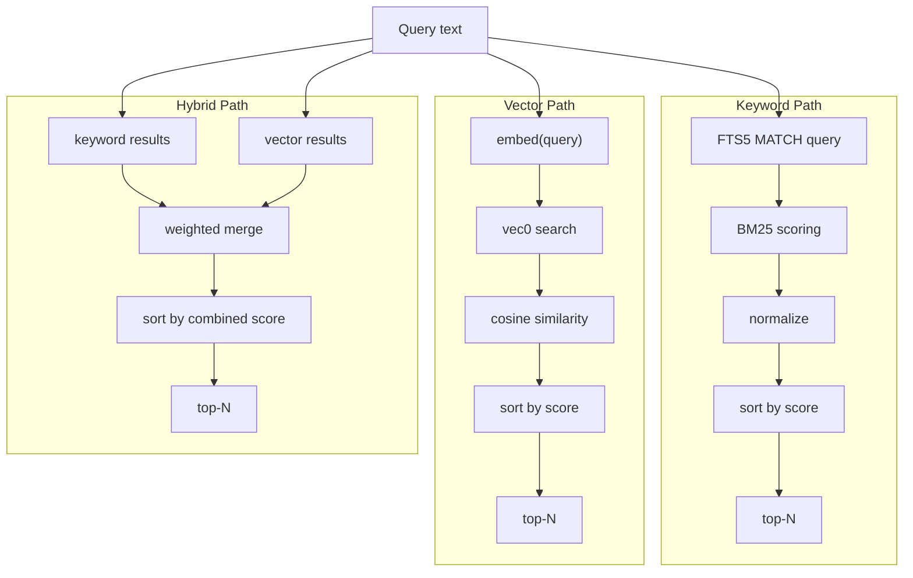
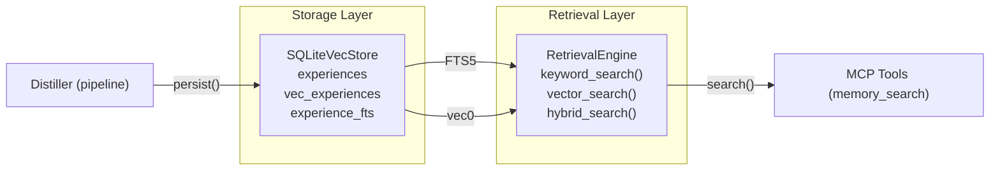
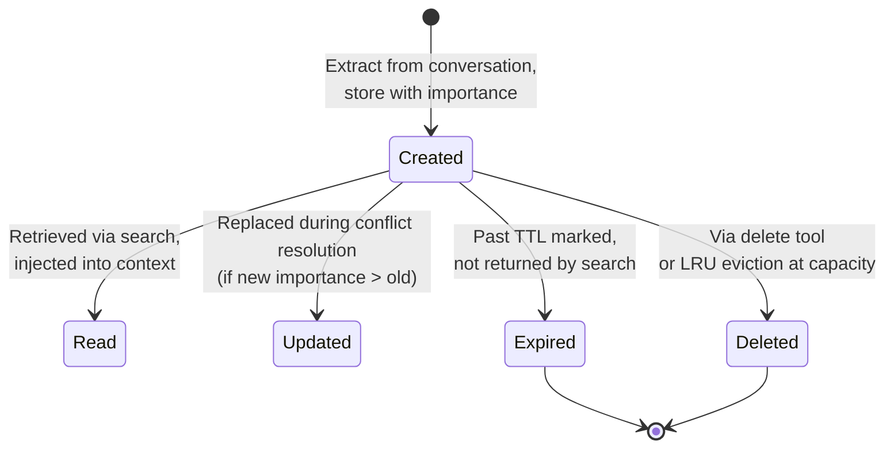

# Storage & Retrieval

## Storage Layer

### SQLiteVecStore

**File**: `src/store.rs`  
**Type**: `SQLiteVecStore`

The storage layer is built on a single SQLite database file using **sqlite-vec** (for vector search) and **FTS5** (for full-text keyword search). This eliminates the need for a separate vector database process.

#### Schema

The database uses three core tables:

**`experiences`** — Main storage table:

```sql
CREATE TABLE IF NOT EXISTS experiences (
    id              TEXT PRIMARY KEY,
    tenant_id       TEXT NOT NULL DEFAULT 'default',
    content         TEXT NOT NULL,
    summary         TEXT NOT NULL DEFAULT '',
    memory_type     TEXT NOT NULL DEFAULT 'knowledge',
    importance      REAL NOT NULL DEFAULT 0.5,
    extraction_method TEXT NOT NULL DEFAULT 'direct',
    conversation_id TEXT NOT NULL DEFAULT '',
    metadata        TEXT NOT NULL DEFAULT '{}',
    source          TEXT NOT NULL DEFAULT 'conversation',
    created_at      TEXT NOT NULL,
    updated_at      TEXT NOT NULL
);
CREATE INDEX idx_experiences_tenant ON experiences(tenant_id);
CREATE INDEX idx_experiences_type ON experiences(memory_type);
```

**`vec_experiences`** — Virtual table for vector search (only created when `vector_dim > 0`):

```sql
CREATE VIRTUAL TABLE IF NOT EXISTS vec_experiences USING vec0(
    id TEXT PRIMARY KEY,
    embedding float[dimension]
);
```

**`experience_fts`** — FTS5 virtual table for keyword search:

```sql
CREATE VIRTUAL TABLE IF NOT EXISTS experience_fts USING fts5(
    content, summary,
    tokenize='unicode61'
);
```

#### ExperienceRepository Trait

```rust
#[async_trait]
pub trait ExperienceRepository: Send + Sync {
    async fn create(&self, exp: &Experience) -> Result<()>;
    async fn get(&self, id: &str) -> Result<Option<Experience>>;
    async fn update(&self, exp: &Experience) -> Result<()>;
    async fn delete(&self, id: &str) -> Result<()>;
    async fn delete_batch(&self, ids: &[String]) -> Result<()>;
    async fn search_by_vector(&self, ...) -> Result<Vec<(Experience, f64)>>;
    async fn search_by_keyword(&self, ...) -> Result<Vec<(Experience, f64)>>;
    async fn get_by_memory_type(&self, ...) -> Result<Vec<Experience>>;
    async fn count_by_memory_type(&self, tenant_id: &str, memory_type: MemoryType) -> Result<i64>;
    async fn count_for_tenant(&self, tenant_id: &str) -> Result<i64>;
    async fn counts_by_type(&self, tenant_id: &str) -> Result<Vec<(MemoryType, i64)>>;
}
```

### Thread Safety

The store is wrapped in `Arc<Mutex<Connection>>` — a single SQLite connection behind a tokio mutex. This provides:

- **Safe concurrent access** from multiple async tasks
- **Serialized writes** (SQLite's natural write serialization)
- **Shared reads** through the single connection

**Note**: For very high throughput, consider switching to `r2d2` connection pooling with WAL mode.

## Retrieval Engine

**File**: `src/retrieval.rs`  
**Type**: `RetrievalEngine`

### Retrieval Modes

| Mode | Description | Score Formula |
|---|---|---|
| `keyword` | FTS5 full-text search + BM25 scoring | `0.7 × BM25 + 0.3 × importance` |
| `vector` | Cosine similarity against stored vectors | `cosine_similarity(query_vec, memory_vec)` |
| `hybrid` | Weighted combination of both | `0.6 × semantic + 0.2 × BM25 + 0.2 × importance` |

### BM25 Scorer

BM25 is the standard probabilistic retrieval function used by modern search engines. The implementation in `src/retrieval.rs`:

```rust
pub(crate) fn bm25_score(query_terms: &[String], document: &str) -> f64
```

**Parameters**:
- `k1 = 1.2` — Term saturation factor
- `b = 0.75` — Length normalization (standard BM25)

**Normalization**: Raw BM25 scores are normalized to `[0, 1]` using `tanh(raw_score / 2.0)` to produce consistent, comparable scores.

**Tokenization**: `unicode61` via FTS5, plus a light pre-processing layer in `tokenize()` that lowercases, splits on whitespace/punctuation, and filters English stopwords.

### Search Pipeline



### Filtering

All retrieval modes support:

| Filter | Description |
|---|---|
| `tenant_id` | Results are always scoped to a tenant |
| `memory_type` | Optional — restrict to a single memory type |
| `limit` | Max results (default: configured `retrieval_limit`, usually 10) |

### Tenant Isolation

Every query is scoped by `tenant_id`. A search for tenant `"alice"` will **never** return memories from tenant `"bob"`. This is enforced at the SQL level (`WHERE tenant_id = ?`).

## Integration: Storage ↔ Retrieval



## Performance Considerations

| Aspect | Keyword Mode | Vector Mode | Hybrid Mode |
|---|---|---|---|
| **Latency** | ~1-5ms | ~10-50ms (includes embed call) | ~15-60ms |
| **API Cost** | $0 | $ per embed call | $ per embed call |
| **Disk Space** | Minimal (~1KB per memory) | ~2KB per memory (includes vectors) | ~2KB per memory |
| **Cold Start** | Instant | Requires embedding service | Requires embedding service |
| **English Recall** | Good (FTS5 + BM25) | Excellent | Excellent |
| **Cross-lingual** | Weak | Good | Good |

## Data Lifecycle


