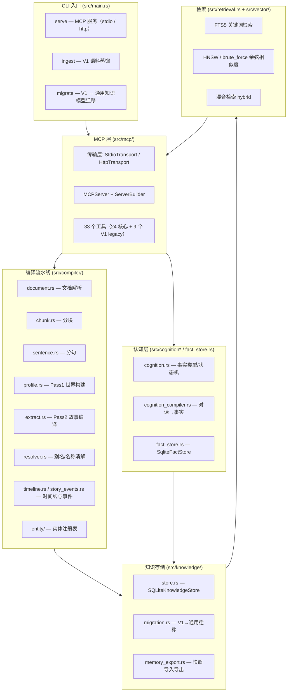
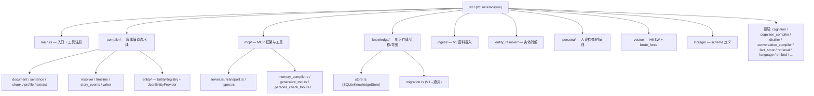
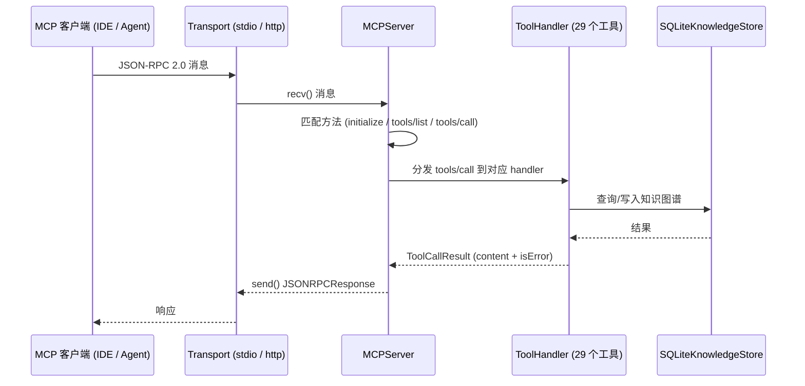
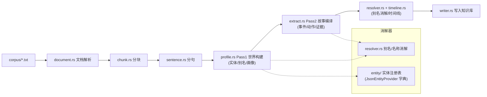
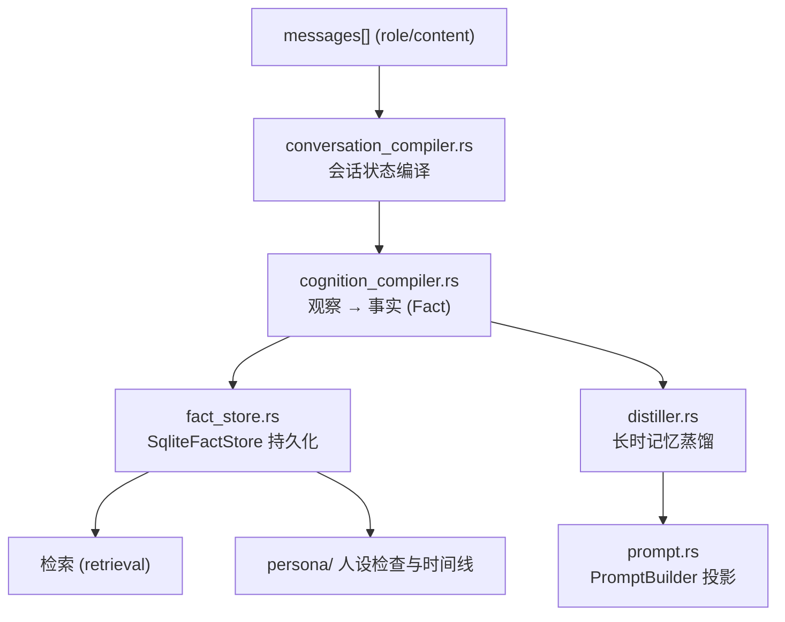
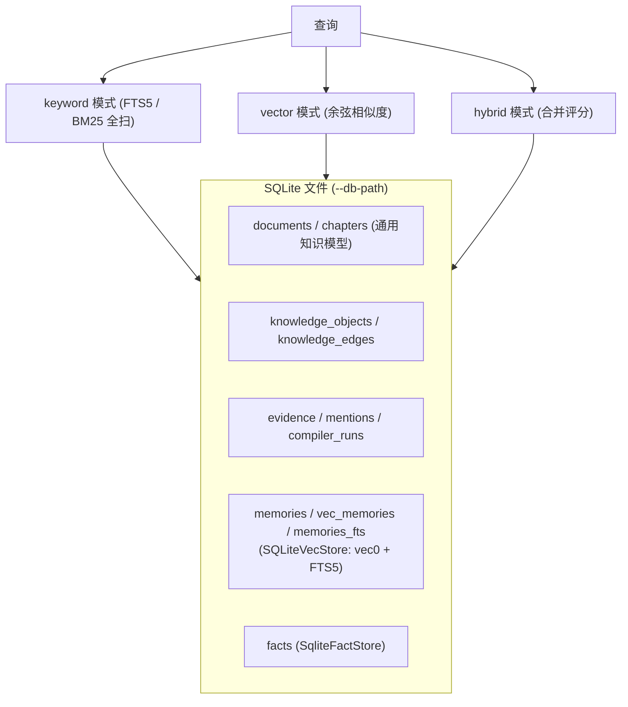
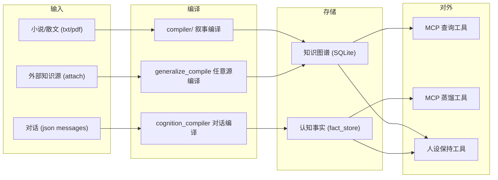

# Mnemosyne 系统架构

> 本文档**实事求是**地描述当前代码库（`src/`）的真实结构，所有图均为 mermaid 格式。
> 代码标识符、文件路径使用英文（与代码一致），叙述使用中文。

## 1. 总览

Mnemosyne 是一个**不依赖 LLM 的知识蒸馏引擎 + MCP 服务**：把叙事文本（小说/对话/散文）
编译为通用知识模型（文档 → 实体 → 事件 → 关系 → 证据），持久化到单一 SQLite 文件，
并通过 MCP 协议对外提供查询/蒸馏/人设保持工具。

## 2. 模块结构（真实目录树）

## 3. MCP 服务架构

**传输层**（`Transport` trait）：

| 实现 | 用途 | 关键点 |
|---|---|---|
| `StdioTransport` | 本地 IDE 接入 | stdin/stdout 逐行 JSON-RPC |
| `HttpTransport` | 远程服务 | SSE 会话隔离（`x-mcp-session-id` 专属频道）、HTTP 强制 `--http-token` 鉴权、常量时间比较 |

## 4. 叙事编译流水线（compiler/）

**实体提供者**（`config/entity_profiles/*.json`）：`sanguo` / `shuihu` / `honglou` /
`xiyou` / `fengshen` / `warandpeace`，为每部小说提供规范实体名与别名。

## 5. 对话 → 认知（cognition 层）

**事实类型**（`cognition.rs`）：Identity / Preference / Goal / Event / Relationship / Emotion 等，
每条事实带证据链（EvidenceRef），不可变、可追踪。

## 6. 存储与检索

| 组件 | 实现 | 说明 |
|---|---|---|
| `SQLiteKnowledgeStore` | `knowledge/store.rs` | 通用知识模型 CRUD（documents/objects/edges/evidence），事务包裹，FK 管理 |
| `SQLiteVecStore` | `store.rs` | 记忆存储：`vec0` 向量表 + `memories_fts` FTS5 表；`MEMORY_VECTOR_DIM=0` 时纯关键词 |
| `SqliteFactStore` | `fact_store.rs` | 认知事实持久化 |
| `RetrievalEngine` | `retrieval.rs` | 检索编排：`keyword`（FTS5/BM25）、`vector`（余弦）、`hybrid`（加权合并） |
| BM25 评分 | `retrieval.rs::bm25_score` | 简化 BM25 变体（仅 k1=1.2，无长度归一化），`tanh` 归一化到 [0,1] |
| 向量检索 | `vector/` HNSW / brute_force | 余弦相似度；零向量统一 `sqrt(2)`（cosine=0.0） |

## 7. 数据流全景

## 8. 关键设计决策（实事求是）

1. **无 LLM 内核** — 编译、蒸馏、检索、人设检查全部为确定性算法（Aho-Corasick 动词匹配、
   bigram Jaccard 相似度、余弦向量检索、规则评分），零 API 依赖，行为可复现。
2. **单一 SQLite 文件** — 元数据、FTS5 索引、向量索引、认知事实全在一处，部署即一个文件。
3. **关键词优先、向量可选** — `MEMORY_VECTOR_DIM=0` 时零嵌入成本完全可用。
4. **双传输 MCP** — stdio 供本地 IDE，HTTP+SSE 供远程（会话隔离 + 强制鉴权 + 文件白名单）。
5. **两套存储分工** — `SQLiteKnowledgeStore`（叙事知识图谱）与 `SqliteFactStore`（对话认知事实），
   通过 `story_bridge` 等工具打通。
6. **V1 遗产保留** — `character_*` 表作为只读视图保留，`migrate` 将其迁入通用知识模型。

## 9. 相关文档

- [蒸馏流水线](distillation-pipeline.md)
- [存储与检索](storage-retrieval.md)
- [MCP 工具](mcp-tools.md)
- [配置](configuration.md)
- [快速开始](getting-started.md)
- [开发指南](development.md)
