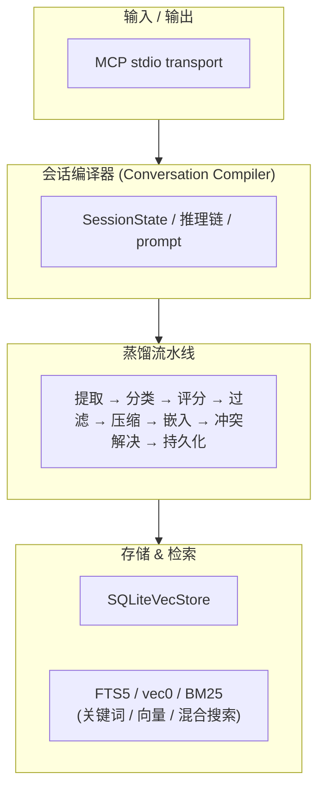
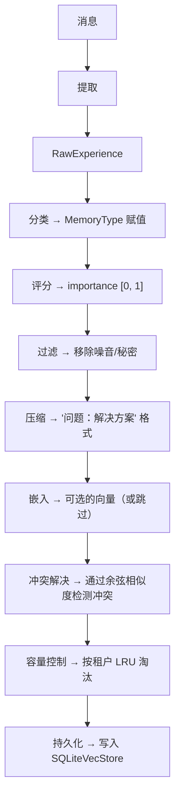
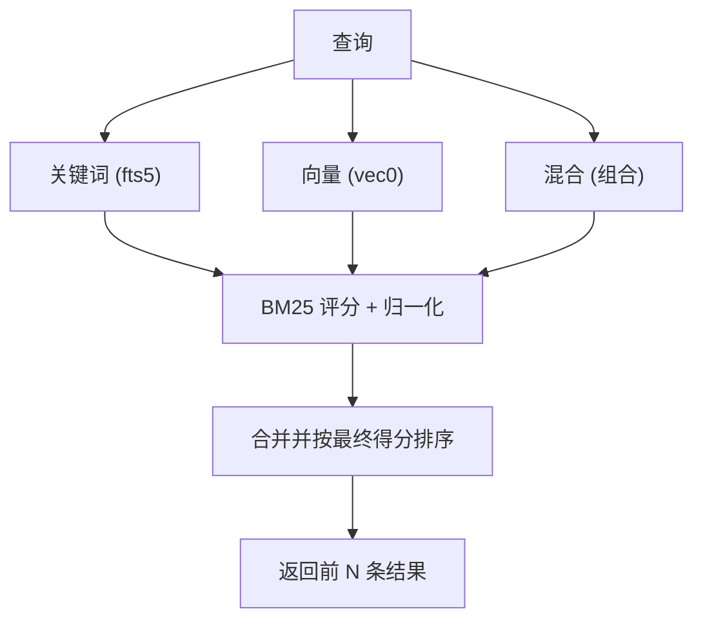

# 系统架构

## 概述

Memory Distillation 服务器由四个主要子系统组成，通过数据流水线连接：

## 子系统

### 1. MCP 传输层

**文件**: `src/mcp/mod.rs`, `src/mcp/server.rs`, `src/mcp/transport.rs`, `src/mcp/types.rs`

服务器基于 stdio 传输实现了 [模型上下文协议 (MCP)](https://modelcontextprotocol.io/)。支持三个 JSON-RPC 2.0 方法：

| 方法 | 用途 |
|---|---|
| `initialize` | 协议握手，返回服务器名称和版本 |
| `tools/list` | 返回所有已注册工具及其输入模式的列表 |
| `tools/call` | 使用提供的参数调用指定工具 |

传输层抽象在 `Transport` trait 后面，使添加替代传输方式（如 TCP、WebSocket）成为可能，而无需更改服务器逻辑。

**关键类型**：
- `MCPServer` — 调度 JSON-RPC 请求的主服务器
- `ServerBuilder` — 用于注册工具和配置服务器的构建器模式
- `ToolHandler` — 工具实现的异步 trait
- `StdioTransport` — 从 stdin 读取 JSON-RPC，写入 stdout

### 2. 会话编译器 (Conversation Compiler)

**文件**: `src/compiler.rs`, `src/prompt.rs`

`ConversationCompiler` 分析原始对话消息，构建结构化的 `SessionState`。它在**蒸馏流水线之前**运行，并产生：

| 组件 | 描述 |
|---|---|
| `current_goal` | 第一条用户消息（假定为会话目标） |
| `current_module` | 从对话中的文件路径检测到的模块名 |
| `current_files` | 会话中提到的文件 |
| `open_problems` | 没有得到助手回答的用户问题 |
| `knowledge` | 从问题-解决方案对中提取的记忆 |
| `decisions` | 通过 `DONE` / `DECIDED` / `CHOSEN` 标记检测到的构建决策 |
| `reasoning_chain` | 包含工具调用的完整推理追踪 |

`PromptBuilder` 随后将这个状态编译成结构化的提示文本，用于下一次会话，包括：

- 按重要性排序的前 5 条知识
- 前 3 条决策
- 会话状态摘要（目标、模块、文件、未解决问题）
- 推理链
- 最近 3 条消息（截断至 200 字符）

### 3. 蒸馏流水线

**文件**: `src/distiller.rs`, `src/extractor.rs`, `src/classifier.rs`, `src/scorer.rs`, `src/filter.rs`, `src/resolver.rs`, `src/embed.rs`

系统的核心——一个 8 阶段流水线。参见 [蒸馏流水线](distillation-pipeline.md) 获取详尽细节。

### 4. 存储 & 检索

**文件**: `src/store.rs`, `src/retrieval.rs`

参见 [存储与检索](storage-retrieval.md) 获取详尽细节。

## 数据流

### 蒸馏流程

### 检索流程

## 关键设计决策

1. **sqlite-vec 而非独立向量数据库** — 简化部署：一个 SQLite 文件包含所有内容（元数据、FTS5 索引、向量索引）。无需独立的向量数据库进程。

2. **关键词优先，向量可选** — 系统在零嵌入成本下完全可用。向量搜索纯粹是附加功能。

3. **确定性分类** — 蒸馏过程中不调用 LLM。分类使用关键词评分。这使得流水线快速、廉价且可测试。

4. **编译会话** — `ConversationCompiler` 在蒸馏之前捕获会话状态，使下一次会话无需重新分析历史就能注入丰富的上下文。

5. **按租户的 LRU 容量控制** — 每个租户有独立按记忆类型的容量限制，通过 LRU 淘汰执行，防止无限制增长。
