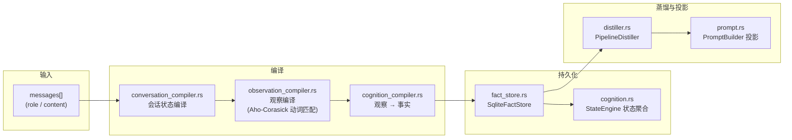
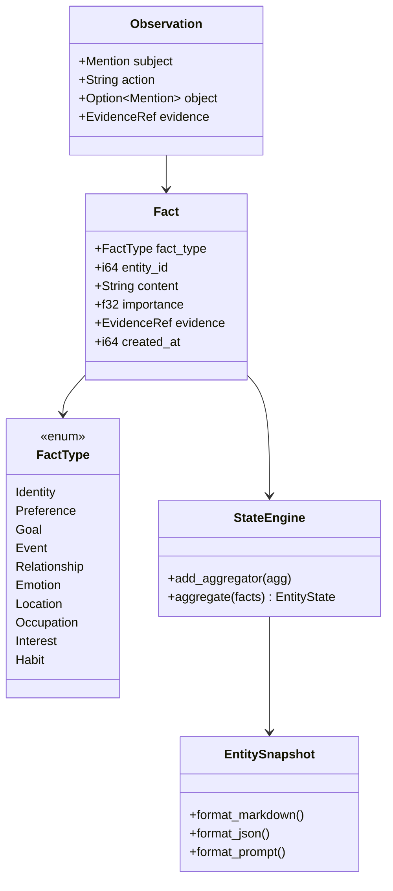
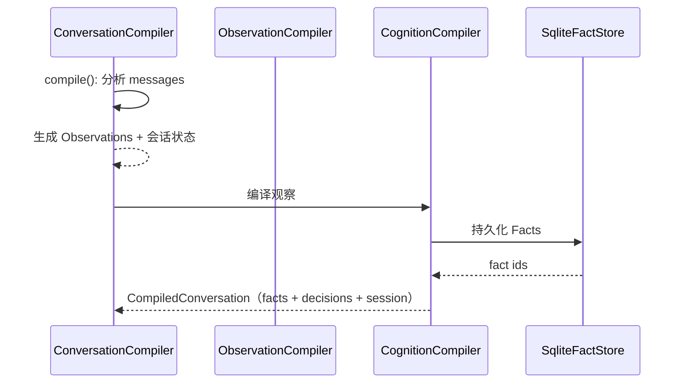

# 模块：认知层（对话 → 事实 → 蒸馏）

> 本文档实事求是地描述认知相关模块：`cognition.rs`、`conversation_compiler.rs`、
> `cognition_compiler.rs`、`fact_store.rs`、`distiller.rs`、`prompt.rs`。
> 它做什么、怎么实现、以及**为什么这么设计**（技术抉择）。图均为 mermaid。

## 1. 概述

认知层是 Mnemosyne 的**对话智能内核**：把一段对话（messages）编译成
**结构化认知状态**（事实 / 决策 / 会话状态），持久化到 `SqliteFactStore`，
并可选蒸馏为长时记忆。它服务于 `memory_compile` / `memory_context_check` 等
MCP 工具与陪伴型 AI 的人设保持（`persona_check` / `persona_timeline`）。

## 2. 核心类型（cognition.rs）

| 类型 | 职责 |
|---|---|
| `Observation` | 编译中间产物：主语 + 动作 + 宾语 + 证据引用 |
| `Fact` | 不可变事实：类型 + 实体 + 内容 + 重要性 + 证据链 |
| `FactType` | Identity / Preference / Goal / Event / Relationship / Emotion / Location / Occupation / Interest / Habit（10 种） |
| `EvidenceRef` | 证据链引用（可回溯原文） |
| `StateEngine` | 事实聚合 → 实体状态（`EntityState`） |
| `EntitySnapshot` | 快照输出：Markdown / JSON / Prompt 三种格式 |
| `CognitiveContext` | 供 AI 的结构化认知上下文 |

## 3. 编译流程（对话 → 事实）

- `conversation_compiler.rs::compile()` 产出 `CompiledConversation`
  （facts + decisions + session state + reasoning chain）。
- `compile_user_observations` / `compile_user_facts` / `user_facts_from_memories`
  分别从消息、观察、既有记忆派生用户事实。

## 4. 技术抉择（为什么这么做）

### 4.1 为什么"事实来自编译"而不是 LLM 总结？

**抉择**：`Observation → Fact` 全程规则驱动（`observation_compiler.rs` 用
Aho-Corasick 动词表匹配动作，`cognition_compiler.rs` 组装事实）。

**为什么**：
- **可追溯**：每条 `Fact` 带 `EvidenceRef` 指向原文——"这条知识从哪句话来"
  随时可查，LLM 总结做不到。
- **可复现**：同一对话编译结果确定，测试可锁定行为。
- **不可变**：`Fact` 一旦落库不修改（只有衰减/归档），保证认知历史完整。

### 4.2 为什么事实不可变、用衰减而非删除？

**抉择**：`SqliteFactStore` 提供 `set_decay`（降权 + 归档），`memory_decay`
工具调用之；`list_archived` 保留归档事实；**永不物理删除**。

**为什么**：陪伴型 AI 的人设演化时间线（`persona_timeline`）需要从完整历史
重建——删除即丢失演化证据。衰减保留记录、降低权重，是可重建的前提。

### 4.3 为什么 `FactStore` 与 `KnowledgeStore` 是两套存储？

**抉择**：认知事实在 `SqliteFactStore`（`facts` 表），叙事知识在
`SQLiteKnowledgeStore`（documents/objects/edges），互不混用。

**为什么**：
- **职责不同**：知识图谱是"世界模型"（叙事世界的事实），事实库是"对话认知"
  （用户/Agent 的长期状态）。混在一起会让查询语义混乱。
- **分工明确**：`story_bridge` 桥接两者（小说角色故事 → 人设事实），
  是显式的转换层而非隐式共享。

### 4.4 为什么 `StateEngine` 用聚合器模式？

**抉择**：`StateAggregator` trait（如 `EmotionAggregator`）注册进
`StateEngine`，`aggregate(facts)` 汇总为 `EntityState`。

**为什么**：不同维度的状态（情绪、目标、偏好）各自独立聚合规则，
可插拔、可测试，避免一个巨型聚合函数。

### 4.5 为什么蒸馏可选（`PipelineDistiller` 为 `Option`）？

**抉择**：`MemoryCompileTool` 持有 `distiller: Option<Arc<PipelineDistiller>>`；
无蒸馏器时只编译事实，有则额外蒸馏长时记忆。

**为什么**：蒸馏是增强而非必需——轻量场景（仅结构化认知）不引入蒸馏开销；
需要长时记忆时按配置开启。

## 5. 详细介绍

### 5.1 `SqliteFactStore`（fact_store.rs）

- `resolve_entity` / `resolve_user` / `resolve_agent`：按外部键解析或创建实体
  （resolve-or-create 语义）。
- `find_entity`：纯只读查询（MCP 只读诊断路径用它，避免无谓写库）。
- 事实 CRUD + `set_decay` / `list_archived` / `get_decay`（衰减支持）。
- `open` / `open_in_memory`：文件库与内存库（测试）。

### 5.2 `PipelineDistiller`（distiller.rs）

8 阶段蒸馏管线（extract → classify → score → filter → compress → embed →
resolve → persist），`DistillationConfig` 控制各阶段；`compress_pair` 把
"问题/解决方案"压缩为记忆条目；`MetricsSnapshot` 暴露蒸馏指标。

### 5.3 `PromptBuilder`（prompt.rs）

把事实 + 决策 + 会话状态投影为结构化 prompt：按重要性排序的知识列表、
决策记录、会话目标/模块/未解决问题、推理链、最近消息——注入下一轮对话。

## 6. 相关

- [系统架构](../zh/architecture.md)
- [知识存储层](knowledge.md)
- [MCP 框架](mcp.md)
- [检索层](retrieval.md)
