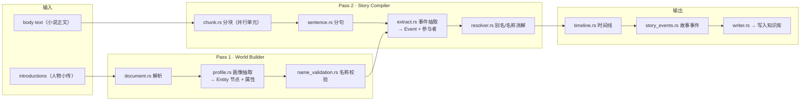

# 模块：叙事编译流水线（src/compiler/）

> 本文档实事求是地描述 `src/compiler/` 模块：它做什么、怎么实现、以及**为什么这么设计**（技术抉择）。图均为 mermaid。

## 1. 概述

`compiler/` 是 Mnemosyne 的**叙事世界建模引擎**（World Model Compiler，版本 V7）：
把非结构化的叙事文本（小说正文 + 人物小传）编译成**以实体为中心的世界模型**
（实体节点 + 事件 + 关系 + 证据），供后续知识图谱查询与 AI Agent 推理。

与 LLM 方案的本质区别：**整个编译过程零 LLM**，全部由确定性规则 + 词典
（`JsonEntityProvider`）+ 统计完成——行为可复现、可测试、可追溯。

## 2. 流水线总览

## 3. 模块文件（真实清单）

| 文件 | 职责 |
|---|---|
| `mod.rs` | 模块根：V7 流水线声明、Chunk/Sentence/ID 共享 IR |
| `document.rs` | 文档解析（corpus 文件 → 结构化文本） |
| `chunk.rs` | 分块：把正文切成**可并行编译**的编译单元 |
| `sentence.rs` | 分句：Chunk → Sentence 序列 |
| `profile.rs` | Pass 1 世界构建：从人物小传抽取实体画像 |
| `extract.rs` | Pass 2 故事编译：`Config::from_language()` + `compile()` |
| `resolver.rs` | 别名/名称消解（多名字角色归并） |
| `name_validation.rs` | 实体名称合法性校验 |
| `timeline.rs` | 时间线构建（事件按章排序、关系时间窗） |
| `story_events.rs` | 故事事件模型（跨角色事件聚合） |
| `faction.rs` | 阵营/势力归属 |
| `pipeline.rs` | 流水线编排与统计（`PipelineStats`） |
| `writer.rs` | 编译结果写入知识存储 |

## 4. 技术抉择（为什么这么做）

### 4.1 为什么分 Pass 1 / Pass 2 两遍编译？

**抉择**：先"世界构建"（从人物小传建实体画像），再"故事编译"（从正文建事件/关系），
而不是一遍扫描。

**为什么**：
- **词典先行**：Pass 1 先产出实体集合与别名表（`resolver.rs` 的别名映射），
  Pass 2 的事件抽取可以基于**已知实体**解析参与者——"谁是主角"在抽事件前就确定，
  避免在正文里边走边猜。
- **别名消解质量**：多名字角色（如"曹操"= "孟德" = "曹孟德"）必须先登记别名，
  否则正文中的变体名会各自成实体。Pass 1 的画像正好提供别名来源（courtesy_name/title）。
- **可验证性**：世界构建（实体集合）可以先被测试断言，再进入故事编译。

### 4.2 为什么按 Chunk 分块、而不是整篇一次编译？

**抉择**：`chunk.rs` 把正文切成多个 Chunk，`sentence.rs` 再逐 Chunk 分句。

**为什么**：
- **并行化**：每个 Chunk 是独立编译单元，可多线程并行（流水线注释明确其为
  "parallel compilation unit"），长篇小说（84k 句）不至于串行卡死。
- **内存有界**：整篇 3.3MB（War and Peace）一次入内存解析风险高；分块让
  峰值内存受 Chunk 大小约束。
- **失败隔离**：单个 Chunk 的编译异常不拖垮整篇。

### 4.3 为什么用规则 + 词典，而不是 LLM？

**抉择**：事件抽取（`extract.rs`）依赖语言提供者
（`Config::from_language(&dyn LanguageProvider)`）配置的动词表/句型规则，
实体识别依赖 `JsonEntityProvider` 词典（`config/entity_profiles/*.json`）。

**为什么**：
- **零 API 依赖**：本地纯计算，无外部调用、无成本、无网络故障面。
- **可复现**：同一语料每次编译结果逐字节一致——这是回归测试的前提
  （`sanguo_compile`、`generalize_corpus_regression` 等靠它锁定行为）。
- **可追溯**：每条事件/关系可追溯到原文句子（EvidenceRef），LLM 抽取做不到这种保证。

### 4.4 为什么语言能力抽象成 `LanguageProvider`？

**抉择**：`EnglishLanguageProvider` / 中文提供者实现同一 trait，
`extract::Config::from_language()` 据此装配动词/句型。

**为什么**：同一套流水线可处理中英文而不写死任何语言特性——动词匹配
（Aho-Corasick）、句法规则、实体命名规范都随 provider 切换。语料里四大名著
（中文）与 War and Peace（英文）共用一套代码即是证据。

## 5. 详细介绍

### 5.1 Pass 1 · World Builder（世界构建）

输入是人物小传（introductions）。`profile.rs` 从每段小传抽取：

- 实体节点（Entity）及其类型
- 属性画像（courtesy_name、title、籍贯、性格等）
- 别名登记（进入 `resolver.rs` 的别名 → 规范名映射）

`name_validation.rs` 负责过滤无效名称（过短、纯标点、噪音），保证实体集合干净。

### 5.2 Pass 2 · Story Compiler（故事编译）

正文经过 `chunk.rs → sentence.rs` 变为句子序列，`extract.rs::compile()` 对每句：

1. 用语言规则的动词表匹配动作（Aho-Corasick 高效多模式匹配）
2. 解析参与者（借助 Pass 1 的实体表 + `resolver.rs` 别名消解）
3. 产出事件（Event：动作 + 参与者 + 时间 + 证据引用）
4. `timeline.rs` 按章序与事件时间窗构建时间线；`story_events.rs` 聚合跨角色事件

### 5.3 输出

`writer.rs` 把 Entity / Event / Relation / Evidence 写入 `SQLiteKnowledgeStore`
（知识模型表），后续由 `inspect_entity` / `timeline` / `relation_graph` 等
MCP 工具查询。

## 6. 相关

- [系统架构](../zh/architecture.md)
- [知识存储层](knowledge.md)
- [检索层](retrieval.md)
