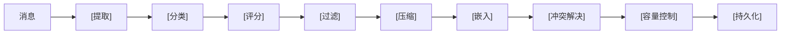
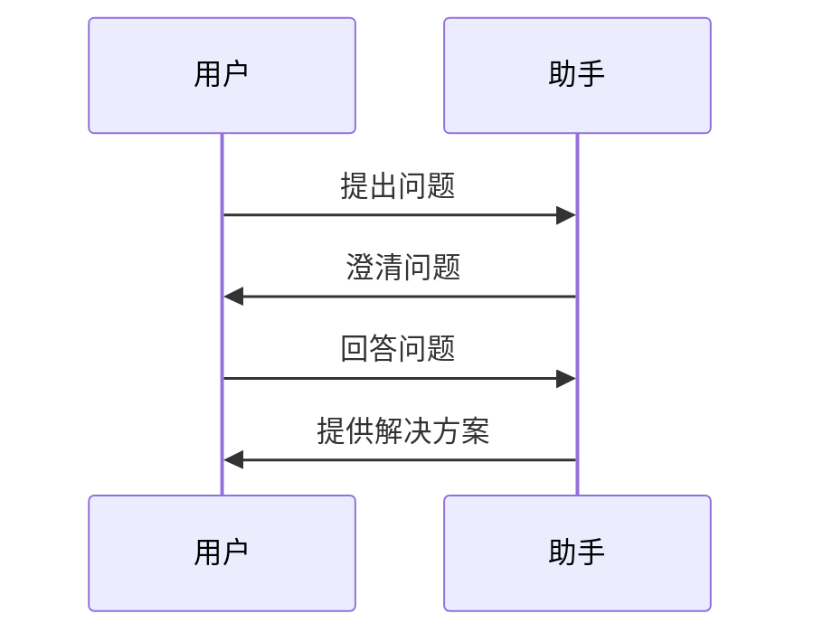
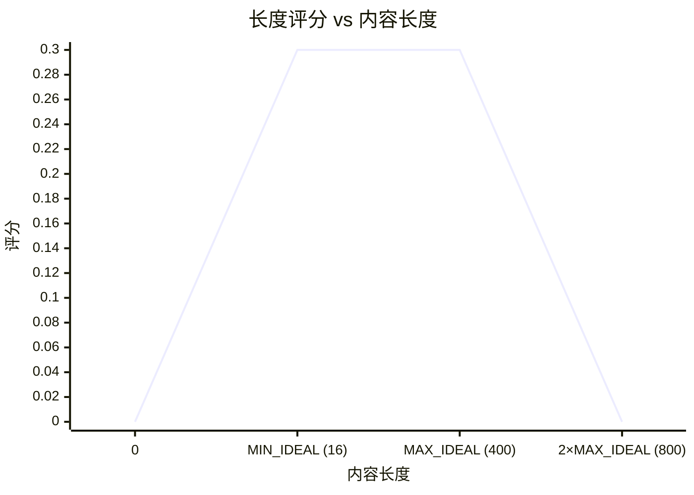
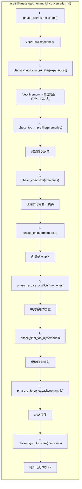

# 蒸馏流水线

蒸馏流水线是系统的核心——一个将原始对话消息转换为结构化、持久化记忆的 8 阶段处理流程。每个阶段都是确定性的、独立可测试的，并且由清晰的数据边界分隔。

## 流水线概览



流水线由 `src/distiller.rs` 中的 `PipelineDistiller` 编排。

## 阶段 1：提取

**文件**: `src/extractor.rs`
**类型**: `ExperienceExtractor`

从对话消息流中提取问题-解决方案对。两种提取模式协同工作：

### 直接提取 (Direct Extraction)

对于每条被 `QuestionDetector`（在 `src/detector.rs` 中）识别为**问题**的用户消息（包含问号 `?` 或疑问关键词如 "how"、"what"、"why"、"can"、"does"），提取器将其与紧随其后的助手回答配对。

**启发式规则** — `is_problem` 检查：
- 内容中是否包含问号 `?`
- 是否包含关键词："how to"、"how do"、"what is"、"why"、"can you"、"does"

如果用户消息不是问题，则跳过该配对。

### 跨轮次提取 (Cross-Turn Extraction)

当通过 `ExtractorConfig` 启用时，提取器构建跨越多个轮次的 4 条消息弧：



这捕获了用户在助手给出最终答案之前自己回答澄清性问题的交互场景。

**输出**: `Vec<RawExperience>` — 每个包含 `problem` 和 `solution` 字符串、`ExtractionMethod`（Direct 或 CrossTurn）以及源 `conversation_id`。

## 阶段 2：分类

**文件**: `src/classifier.rs`
**类型**: `MemoryClassifier`

使用轻量级关键词评分为每个问题-解决方案对分配 `MemoryType`：

| 记忆类型 | 示例关键词 | 含义 |
|---|---|---|
| `Knowledge` | "how to", "error", "fix", "cause", "solution" | 技术知识、Bug 修复 |
| `Skill` | （预留，目前与 Knowledge 合并） | 程序性能力 |
| `Preference` | "prefer", "always use", "convention", "style" | 用户偏好和约定 |
| `Experience` | （上下文相关的经验教训） | 情境经验 |
| `Profile` | "i am", "my name", "i work", "i use" | 用户身份和背景 |
| `Interaction` | "today", "yesterday", "this session" | 临时的、时间相关的表述 |

**算法**：
1. 拼接 `problem` + `solution` 并转为小写
2. 对照每种类型的手动管理的关键词列表计算子串匹配数
3. 选择匹配数最多的类型；平局时按数组顺序裁决
4. 如果没有关键词匹配，默认归为 `Knowledge`

**确定性**：相同输入总是产生相同的分类。

## 阶段 3：评分

**文件**: `src/scorer.rs`
**类型**: `ImportanceScorer`

结合三个信号分配 `[0.0, 1.0]` 范围内的重要性评分：

### 信号权重

| 信号 | 权重 | 描述 |
|---|---|---|
| `BASE_SCORE` | 0.10 | 每条记忆以这个基线值开始 |
| `KEYWORD_WEIGHT` | 每次匹配 0.08（最多 6 次） | 高价值关键词：error、crash、security、migration 等 |
| `LENGTH_WEIGHT` | 0.30 | 最佳长度（16–400 字符）得分最高 |
| `TYPE_WEIGHT` | 0.40 × type_bias | Knowledge (0.95) > Profile (0.85) > Experience (0.70) > Preference (0.65) > Interaction (0.40) |

### 长度评分曲线



### 公式

```text
score = BASE_SCORE + keyword_score + length_score + (type_bias × TYPE_WEIGHT)
result = clamp(score, 0.0, 1.0)
```

## 阶段 4：过滤

**文件**: `src/filter.rs`
**类型**: `NoiseFilter`, `SecurityFilter`

两个独立的过滤器在存储之前移除低质量和危险的内容。

### NoiseFilter（噪音过滤器）

拒绝以下消息：
- **太短**：少于 `MIN_MEANINGFUL_LENGTH`（8）个字符
- **太长**：超过 `MAX_MESSAGE_LENGTH`（8,000）个字符
- **闲聊**：匹配已知的随意短语，如 "got it"、"thanks"、"sure"、"ok"、"let me know"、"you're welcome"

`retain_indices` 方法返回一个布尔掩码，保持消息顺序。

### SecurityFilter（安全过滤器）

使用正则表达式模式检测敏感内容：
- API Key（`sk-...`、`pk-...`）
- AWS 访问密钥（`AKIA...`）
- GitHub Token（`ghp_...`、`gho_...`、`github_pat_...`）
- Bearer Token、JWT Token
- 自定义模式（可通过 `with_patterns` 扩展）

**设计**：过滤是保守的——任何匹配都会丢弃整条消息。宁可丢掉一条边缘记忆，也不能泄露秘密。

## 阶段 5：压缩

**文件**: `src/distiller.rs`（`compress_pair` 函数）

将问题-解决方案对压缩为标准化的字符串格式：

```
问题：<问题截断至 60 字符>
解决方案：<解决方案截断至 120 字符>
```

**截断**：字符安全（处理多字节 UTF-8，在字形边界截断）。

**双向**：该格式既可人工阅读也可机器解析。

## 阶段 6：嵌入

**文件**: `src/embed.rs`
**类型**: `EmbeddingService` trait, `NullEmbedder`, `RemoteEmbedder`

可选地将压缩后的记忆转换为向量嵌入。

### 嵌入提供者

| 提供者 | 行为 |
|---|---|
| `none` (NullEmbedder) | 返回空向量；`enabled() == false`。检索回退到纯关键词模式。零 API 成本。 |
| `openai` (RemoteEmbedder) | HTTP POST 到 OpenAI 兼容的 `/embed` 端点。需要 `MEMORY_OPENAI_API_KEY`。 |
| `ollama` (RemoteEmbedder) | 相同接口，指向本地 Ollama 实例。 |

### EmbeddingService Trait

```rust
#[async_trait]
pub trait EmbeddingService: Send + Sync {
    async fn embed(&self, text: &str) -> Result<Vec<f32>>;
    async fn embed_with_prefix(&self, text: &str, prefix: &str) -> Result<Vec<f32>>;
    async fn embed_batch(&self, texts: &[String]) -> Result<Vec<Vec<f32>>>;
    async fn health_check(&self) -> Result<()>;
    fn model(&self) -> &str;
    fn timeout(&self) -> Duration;
    fn enabled(&self) -> bool;
}
```

**注意**：`embed_batch` 当前是顺序迭代的。当上游支持时，可以用批量 HTTP 调用覆盖。

## 阶段 7：冲突解决

**文件**: `src/resolver.rs`
**类型**: `ConflictResolver`

使用向量嵌入的**余弦相似度**检测并解决新记忆与现有记忆之间的语义冲突。

### 算法

1. 对于每条新记忆，将其向量与相同 `MemoryType` 和 `tenant_id` 的所有现有记忆进行比较
2. 如果 `cosine_similarity(a, b) >= threshold`（默认值：0.92），则视为冲突
3. **解决**：
   - 如果新记忆的重要性更高 → **替换**旧记忆
   - 如果新记忆的重要性更低或相等 → **两者都保留**（保留语义多样性）
4. 没有向量的记忆（关键词模式）跳过冲突检测——两者都存储

### 余弦相似度

```rust
pub fn cosine_similarity(a: &[f32], b: &[f32]) -> Option<f64>
```

如果维度不同或任一向量为零幅度，则返回 `None`。

## 阶段 8：容量控制

**文件**: `src/distiller.rs`（`phase_enforce_capacity`）

使用 LRU 淘汰执行按租户、按类型的容量限制。

| 参数 | 默认值 | 描述 |
|---|---|---|
| `max_memories_per_type` | 5000 | 每个租户每种 `MemoryType` 的最大记忆数 |
| 淘汰策略 | LRU | 最近最少更新的记忆优先被淘汰 |

**租户隔离**：每个租户的容量独立跟踪，因此一个租户不会挤占另一个租户。

## 指标

`PipelineDistiller` 通过 `DistillationMetrics` 暴露实时指标：

| 指标 | 描述 |
|---|---|
| `extracted_count` | 从消息中提取的原始配对数量 |
| `classified_count` | 通过分类的配对数量 |
| `scored_count` | 通过评分并超过 `min_importance` 的配对数量 |
| `filtered_count` | 被噪音/安全过滤器移除的配对数量 |
| `compressed_count` | 压缩后的配对数量 |
| `embedded_count` | 成功嵌入的配对数量 |
| `conflicts_detected` | 与现有记忆冲突的配对数量 |
| `conflicts_replaced` | 新记忆替换旧记忆的冲突数量 |
| `stored_count` | 最终写入数据库的数量 |
| `rejected_low_importance` | 低于 `min_importance` 的配对数量 |
| `errors_count` | 流水线遇到的错误数量 |

## 完整流水线序列


