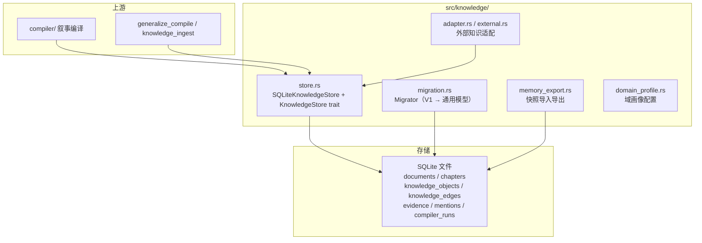

# 模块：知识存储层（src/knowledge/）

> 本文档实事求是地描述 `src/knowledge/` 模块：它做什么、怎么实现、以及**为什么这么设计**（技术抉择）。图均为 mermaid。

## 1. 概述

`knowledge/` 是 Mnemosyne 的**知识持久化层**：把编译产出的世界模型
（文档 / 实体 / 关系 / 证据）落进 SQLite，并提供 CRUD、迁移、快照导出、
外部知识接入等能力。它是检索层与 MCP 工具的数据底座。



## 2. 模块文件（真实清单）

| 文件 | 职责 |
|---|---|
| `store.rs` | `SQLiteKnowledgeStore`（核心 CRUD）+ `KnowledgeStore` trait + 事务/FK 管理 |
| `migration.rs` | `Migrator`：V1 `character_*` 表 → 通用知识模型迁移 |
| `memory_export.rs` | 知识图谱快照序列化（ExportBundle）与导入 |
| `adapter.rs` / `external.rs` | 外部知识源适配（文档/词表/DB） |
| `entity_linker.rs` | 跨源实体链接器（外部表面名 → 统一图节点） |
| `companion_extract.rs` | 陪伴型场景实体抽取 |
| `document_source.rs` | 统一文档源抽象（`DocumentSource` trait） |
| `domain_profile.rs` | 域画像（`DomainProfile`）：编译配置包 |
| `key_events.rs` | 关键事件提炼逻辑 |
| `pdf.rs` | PDF 语料解析 |
| `format.rs` | 格式检测 |
| `mod.rs` | 模块导出 |

## 3. 核心模型

```mermaid
erDiagram
    documents ||--o{ chapters : contains
    documents ||--o{ knowledge_objects : contains
    documents ||--o{ evidence : contains
    knowledge_objects ||--o{ knowledge_edges : source
    knowledge_objects ||--o{ knowledge_edges : target
    knowledge_objects ||--o{ mentions : has
    chapters ||--o{ mentions : locates
    knowledge_objects ||--o{ evidence : linked
    knowledge_edges ||--o{ evidence : linked

    documents { int id PK }
    chapters { int id PK, int doc_id FK, int chapter_no }
    knowledge_objects { int id PK, int doc_id FK, text object_type, text name }
    knowledge_edges { int id PK, int source_id FK, int target_id FK, text predicate }
    evidence { int id PK, int doc_id FK, text content }
    mentions { int id PK, int object_id FK, int chapter_id FK }
    compiler_runs { int id PK, int doc_id FK }
```

## 4. 技术抉择（为什么这么做）

### 4.1 为什么抽象出 `KnowledgeStore` trait？

**抉择**：`trait KnowledgeStore: Send + Sync` 定义领域接口，
`SQLiteKnowledgeStore` 实现之；MCP 工具与编译器只依赖 trait。

**为什么**：
- **替换自由**：测试可用内存实现（`open_in_memory`），未来可换其他后端，
  调用方零改动。
- **接口即文档**：领域操作（create_document / create_object / create_edge /
  search_evidence / inspect_entity ...）集中在 trait，读接口即懂能力。

### 4.2 为什么所有写操作包事务？

**抉择**（`store.rs`）：`begin_transaction` / `commit_transaction` /
`rollback_transaction` 固有方法；`clear_all` / `clear_for_document` 等
批量写操作包在事务里，PRAGMA foreign_keys 在事务外执行。

**为什么**：
- **原子性**：多表 DELETE 中途失败会留下半删数据 + FK 永久关闭（修复项），
  事务包裹保证要么全成要么全回滚。
- **FK 一致性**：`PRAGMA foreign_keys` 在事务内是 no-op，必须事务外设置。

### 4.3 为什么 V1 表保留为只读视图、用 `Migrator` 迁移？

**抉择**（`migration.rs`）：`character_*` 表（V1 语料蒸馏产物）不删除，
`Migrator::migrate()` 把它们 + corpus 文本迁移进通用知识模型。

**为什么**：
- **不破坏既有数据**：V1 是历史资产，保留只读视图供旧工具使用。
- **幂等重建**：迁移可重复执行（按小说 title 复用 document，先清后写），
  是"干净重建"而非"累积追加"。
- **事务原子**：`migrate()` 用 H6 事务包裹整轮迁移，失败整体回滚；
  V1 数据**预读快照**在事务外完成，避免双连接（v1/knowledge 同一文件）锁冲突。

### 4.4 为什么提供快照导出/导入（memory_export）？

**抉择**（`memory_export.rs`）：`ExportBundle` 序列化整个知识图谱，
`memory_export` / `memory_import` 工具对应备份与还原。

**为什么**：记忆"永不丢失"的保证——可跨机器迁移、备份、共享还原
（companion persona 的长期记忆可整体搬迁）。

### 4.5 为什么引入 `DocumentSource` trait 统一输入？

**抉择**（`document_source.rs`）：`RawTextSource`（文本）、`DialogSource`
（对话 messages）等实现同一 trait，`compile_source()` 统一消费。

**为什么**：`generalize_compile` 一个工具就能编译"任意源"——散文走 text、
对话走 dialog、外部文档走 attach，编译管线复用而非复制。

## 5. 详细介绍：关键操作

### 5.1 `SQLiteKnowledgeStore::open`（幂等建表）

打开 SQLite 文件，`CREATE TABLE IF NOT EXISTS` 建全量表（V7 通用模型），
支持 `open_in_memory()` 供测试。FK 默认开启，busy_timeout 防止并发锁死。

### 5.2 `KnowledgeStore` trait 主要方法

| 方法 | 用途 |
|---|---|
| `create_document` / `find_document_by_title` | 文档生命周期 |
| `create_chapter` | 章节（含字节偏移） |
| `create_object` / `create_edge` | 实体与关系 |
| `create_evidence` / `link_evidence` | 证据与链接 |
| `create_mention` | 角色章节提及 |
| `create_run` / `finish_run` | 编译运行追踪 |
| `inspect_entity` / `search_evidence` / `search_objects` | 查询（实体画像/证据/对象） |
| `clear_all` / `clear_for_document` | 清库 / 按文档清除（事务包裹） |

## 6. 相关

- [系统架构](../zh/architecture.md)
- [叙事编译流水线](compiler.md)
- [检索层](retrieval.md)
- [MCP 框架](mcp.md)
