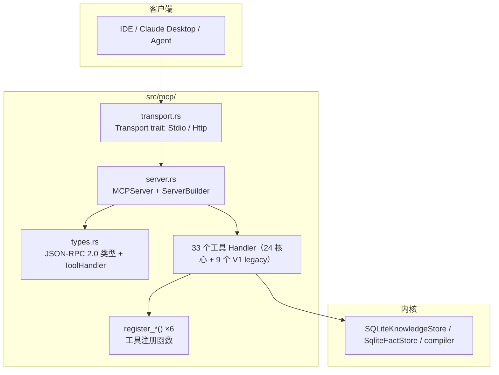
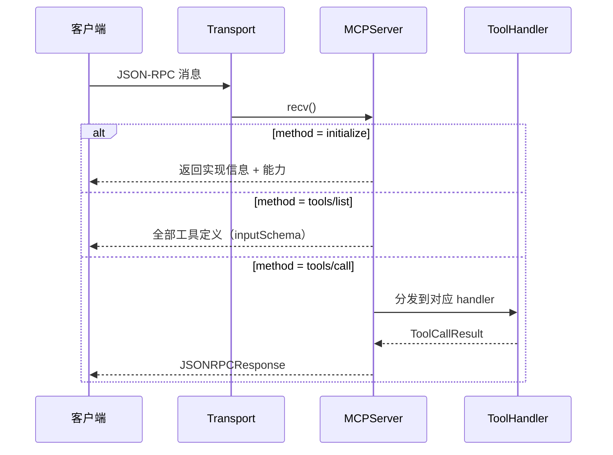
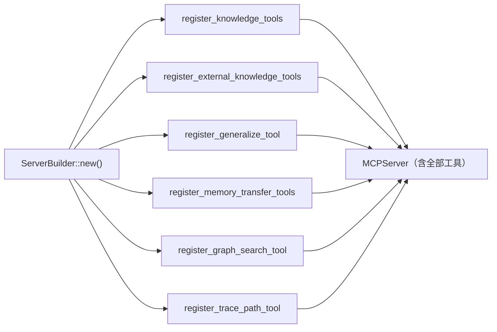

# 模块：MCP 框架与工具（src/mcp/）

> 本文档实事求是地描述 `src/mcp/` 模块：它做什么、怎么实现、以及**为什么这么设计**（技术抉择）。图均为 mermaid。

## 1. 概述

`mcp/` 是 Mnemosyne 的**对外服务层**：实现 [Model Context Protocol (MCP)](
https://modelcontextprotocol.io) 的 JSON-RPC 2.0 服务端，并注册全部对外工具。
它是 IDE / Agent 与知识引擎之间的唯一入口——客户端通过 `initialize` /
`tools/list` / `tools/call` 三个方法发现并调用工具。

## 2. 模块文件（真实清单）

| 文件 | 职责 |
|---|---|
| `server.rs` | `MCPServer`（JSON-RPC 分发）、`ServerBuilder`（工具注册） |
| `transport.rs` | `Transport` trait + `StdioTransport` |
| `http_server.rs` | `HttpTransport`（HTTP+SSE）、`AppState`、会话隔离、鉴权 |
| `sse.rs` | Server-Sent Events 流 |
| `types.rs` | JSON-RPC 2.0 类型、`ToolDefinition`、`ToolHandler` trait |
| `mod.rs` | 模块导出 |
| `memory_compile.rs` | 对话 → 认知事实编译工具 |
| `context_aware.rs` | 上下文感知蒸馏（阈值门控） |
| `generalize_tool.rs` | 任意源 → 知识图谱编译 |
| `knowledge_tools.rs` | inspect_entity / timeline / relation_graph / correct_relation / cognitive_context |
| `graph_search_tool.rs` | search_graph 结构化图搜索 |
| `trace_path_tool.rs` | 最短关系路径（BFS） |
| `persona_check_tool.rs` / `persona_inject_tool.rs` | 人设一致性守护 / 人设注入 |
| `relationship_tool.rs` | relationship_update / query / persona_timeline |
| `story_bridge_tool.rs` | 小说角色 → 人设事实桥接 |
| `decay_tool.rs` | 记忆衰减 |
| `key_events_tool.rs` | 关键事件提炼 |
| `memory_transfer_tools.rs` | memory_export / import（文件白名单） |
| `external_knowledge_tools.rs` | knowledge_attach / ingest / agent_fact_compile |
| `external_knowledge_tools_tests.rs` | 外部知识工具测试 |

## 3. 核心机制

### 3.1 请求分发（MCPServer）

### 3.2 工具注册（ServerBuilder）

## 4. 技术抉择（为什么这么做）

### 4.1 为什么用标准 MCP，而不是自定义 API？

**抉择**：实现 MCP 规范（JSON-RPC 2.0 + initialize/tools/list/tools/call）。

**为什么**：MCP 是事实标准，Claude Desktop / Cursor / VS Code 等宿主开箱即用——
不写宿主侧适配代码，接入成本为零。自定义 REST API 需要每个客户端单独对接。

### 4.2 为什么传输层抽象成 `Transport` trait？

**抉择**：`Transport` trait（`recv`/`send`），`StdioTransport` 与 `HttpTransport`
各自实现；`MCPServer::serve(&mut dyn Transport)` 与传输无关。

**为什么**：
- **一份服务器逻辑，两种接入**：本地 IDE 用 stdio，远程部署用 HTTP+SSE，内核零改动。
- **可测试性**：测试可用内存 channel 模拟传输（如 `transport_round_trips_over_channels`）。

### 4.3 为什么 HTTP 要会话隔离 + 强制鉴权？

**抉择**（`http_server.rs`）：
- 每个客户端携带 `x-mcp-session-id`，`AppState` 维护
  `session_id → broadcast::Sender` 映射；`HttpTransport::send` 按当前会话路由到专属频道。
- HTTP 模式未提供 `--http-token` 拒绝启动；token 比较用常量时间（XOR 全缓冲）。

**为什么**：
- **多客户端串台是协议级 bug**：单全局广播会让 A 的响应推给 B。会话隔离让
  并发客户端互不干扰（此前修复的 High 项）。
- **HTTP 暴露在网络**：无鉴权等于裸奔；常量时间比较防时序侧信道泄露 token。

### 4.4 为什么 `memory_transfer` 的 path 要白名单？

**抉择**：`memory_export/import` 的 `path` 经 `resolve_transfer_path` 校验，
拒绝绝对路径与 `..` 逃逸，限定在 `exports/` 目录内。

**为什么**：MCP 客户端是外部输入，任意 path 等于把宿主文件系统暴露给客户端
（安全修复项）。白名单把影响面钉死在导出目录。

### 4.5 为什么工具定义用 `inputSchema`（camelCase）？

**抉择**：`ToolDefinition.input_schema` 序列化为 `inputSchema`。

**为什么**：MCP wire contract 要求 camelCase；严格客户端按规范取字段，
snake_case 会导致 schema 丢失（对照 codescope 修复的回归）。

## 5. 详细介绍：工具分类

| 类别 | 工具 | 用途 |
|---|---|---|
| 对话编译 | `memory_compile`、`agent_fact_compile`、`memory_context_check` | 对话 → 事实/知识/会话状态 |
| 知识编译 | `generalize_compile`、`knowledge_attach`、`knowledge_ingest` | 任意源 → 知识图谱 |
| 知识查询 | `inspect_entity`、`timeline`、`relation_graph`、`search_graph`、`trace_path`、`evidence`、`correct_relation`、`cognitive_context`、`person_key_events` | 图谱检索与实体画像 |
| 人设保持 | `persona_check`、`persona_inject`、`relationship_update`、`relationship_query`、`persona_timeline`、`story_bridge` | 陪伴型 AI 人设不崩 |
| 记忆维护 | `memory_decay`、`memory_export`、`memory_import` | 衰减、备份、迁移 |

## 6. 相关

- [系统架构](../zh/architecture.md)
- [知识存储层](knowledge.md)
- [检索层](retrieval.md)
- [认知层](cognition.md)
