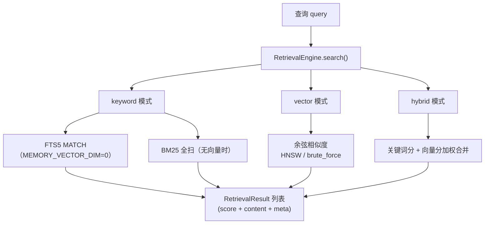

# 模块：检索层（src/retrieval.rs + src/vector/ + store 检索）

> 本文档实事求是地描述检索相关实现：它做什么、怎么实现、以及**为什么这么设计**（技术抉择）。图均为 mermaid。

## 1. 概述

检索层回答一个问题：**给定查询，如何从记忆与知识库中找出最相关的结果**。
支持三种模式（`RetrievalMode`）：`keyword`（FTS5 / BM25）、`vector`
（余弦相似度）、`hybrid`（加权合并）。它是 `memory_search`、`inspect_entity`
证据查询、`persona_check` 语义匹配的底层引擎。

## 2. 核心结构

| 类型 | 文件 | 职责 |
|---|---|---|
| `RetrievalEngine` | `retrieval.rs` | 检索编排：模式选择、外部知识注册表、合并评分 |
| `RetrievalResult` | `retrieval.rs` | 单条结果：score + content + 元数据 |
| `bm25_score` | `retrieval.rs` | 简化 BM25（仅 k1=1.2，tanh 归一化） |
| `VectorIndex` trait | `vector/mod.rs` | 向量索引抽象 |
| `HnswIndex` | `vector/hnsw.rs` | 近似最近邻（大图） |
| `BruteForceIndex` | `vector/brute_force.rs` | 精确 O(N) 全扫（ground truth） |
| `fts5_query` | `store.rs` | FTS5 MATCH 查询转义 |

## 3. 技术抉择（为什么这么做）

### 3.1 为什么默认 keyword、向量可选？

**抉择**：`MEMORY_VECTOR_DIM=0`（默认）时纯关键词（FTS5），
`>0` 才启用向量检索；`RetrievalMode` 可显式选 `vector` / `hybrid`。

**为什么**：
- **零嵌入成本可用**：不依赖任何 embedding 服务也能完成检索——
  部署、测试、离线全部可行。
- **渐进增强**：需要语义相似时再加向量（远程 embedding provider，
  如 OpenAI/Ollama），检索层对两种形态透明。

### 3.2 为什么关键词要 FTS5 与 BM25 双路径？

**抉择**（`store.rs`）：`MEMORY_VECTOR_DIM=0` 走 FTS5 `MATCH`（索引加速）；
无向量但有全文需求时走 `bm25_score` 全扫（`search_by_keyword`）。

**为什么**：
- FTS5 索引查询 O(log n)，是主力路径；但 FTS5 分词对 CJK 支持弱
  （`unicode61` 对中文按整句），BM25 全扫（按词元匹配）是中文回退路径。
- 两者都归一化到 [0,1]，保证后续合并评分量纲一致。

### 3.3 为什么 HNSW 与 brute_force 并存？

**抉择**：`HnswIndex`（近似）与 `BruteForceIndex`（精确）实现同一
`VectorIndex` trait。

**为什么**：
- **规模分层**：小数据（测试、单文档）用精确全扫，大数据用 HNSW 近似。
- **一致性锚点**：零向量在两处约定一致（距离 `sqrt(2)` ⇔ cosine=0.0），
  测试断言两者结果可比——近似不能偏离精确太多。

### 3.4 为什么混合检索要合并评分而非取交集？

**抉择**（`retrieval.rs`）：keyword 分与 vector 分加权合并（如
`0.6 × 语义 + 0.2 × BM25 + 0.2 × importance`）。

**为什么**：
- 单信号都有盲区：关键词漏语义近义，向量漏精确专名。合并提高召回与排序质量。
- 无向量的条目（legacy 数据）自动回退关键词分，不会静默丢失。

### 3.5 为什么 FTS5 查询必须转义？

**抉择**（`store.rs::fts5_query`）：对 `"` `:` `(` 等 FTS5 语法字符做安全转义。

**为什么**：FTS5 对裸特殊字符直接抛语法错误——用户输入含 `:` 的查询
（如文件名）会整条失败。转义让任意输入安全可用（安全修复项）。

## 4. 详细介绍

### 4.1 `RetrievalEngine` 能力

- `new()`：装配语言/维度配置。
- `with_external_registry` / `set_external_registry`：挂载外部知识注册表，
  检索可覆盖 `knowledge_attach` 接入的外部源。
- `search()`：按 `mode` 分发 keyword / vector / hybrid，返回 `RetrievalResult`。

### 4.2 评分信号

| 信号 | 来源 | 量纲 |
|---|---|---|
| keyword | `bm25_score`（简化变体，仅 k1=1.2，无长度归一化）| tanh 归一化 [0,1] |
| vector | 余弦相似度（HNSW / brute_force）| [0,1]（零向量约定 0.0）|
| importance | 记忆/事实重要性 | [0,1] |

### 4.3 零向量约定

`cosine = 1 - d²/2`，零向量下 `d = sqrt(2)` 使 cosine = 0.0——与
`BruteForceIndex` 一致，避免 HNSW 与全扫对退化输入给出矛盾结果（修复项）。

## 5. 相关

- [系统架构](../zh/architecture.md)
- [知识存储层](knowledge.md)
- [认知层](cognition.md)
- [MCP 框架](mcp.md)
