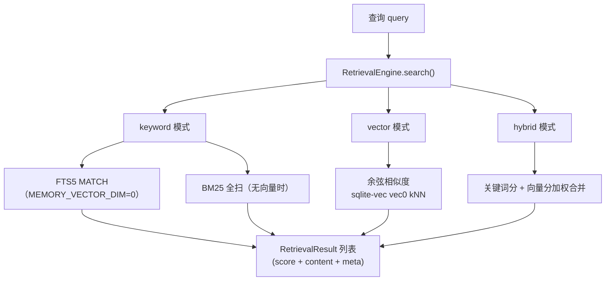

# 模块：检索层（src/retrieval.rs + store 检索）

> 本文档实事求是地描述检索相关实现：它做什么、怎么实现、以及**为什么这么设计**（技术抉择）。图均为 mermaid。

## 1. 概述

检索层回答一个问题：**给定查询，如何从记忆与知识库中找出最相关的结果**。
支持三种模式（`RetrievalMode`）：`keyword`（FTS5 / BM25）、`vector`
（余弦相似度）、`hybrid`（加权合并）。它是 `memory_search`、`inspect_entity`
证据查询、`persona_check` 语义匹配的底层引擎。

```mermaid
flowchart TD
    Q["查询 query"] --> RE["RetrievalEngine.search()"]

    RE --> KW["keyword 模式"]
    RE --> VC["vector 模式"]
    RE --> HY["hybrid 模式"]

    KW --> F1["FTS5 MATCH（MEMORY_VECTOR_DIM=0）"]
    KW --> B1["BM25 全扫（无向量时）"]
    VC --> V1["余弦相似度<br/>sqlite-vec vec0 kNN"]
    HY --> M1["关键词分 + 向量分加权合并"]

    F1 --> R["RetrievalResult 列表<br/>(score + content + meta)"]
    B1 --> R
    V1 --> R
    M1 --> R
```

## 2. 核心结构

| 类型 | 文件 | 职责 |
|---|---|---|
| `RetrievalEngine` | `retrieval.rs` | 检索编排：模式选择、外部知识注册表、合并评分 |
| `RetrievalResult` | `retrieval.rs` | 单条结果：score + content + 元数据 |
| `bm25_score` | `retrieval.rs` | 简化 BM25（仅 k1=1.2，tanh 归一化） |
| `search_by_vector` | `store/repository.rs` | 对 `vec_memories`（`vec0` 虚表，sqlite-vec）做 kNN |
| `fts5_query` | `store.rs` | FTS5 MATCH 查询转义 |

## 3. 技术抉择（为什么这么做）

### 3.1 为什么默认 keyword、向量可选？

**抉择**：`MEMORY_VECTOR_DIM=0`（默认）时纯关键词（FTS5），
`>0` 才启用向量检索；`RetrievalMode` 可显式选 `vector` / `hybrid`。

**为什么**：
- **零嵌入成本可用**：不依赖任何 embedding 服务也能完成检索——
  部署、测试、离线全部可行。
- **渐进增强**：需要语义相似时再加向量（远程 embedding provider，
  如 OpenAI/Ollama），检索层对两种形态透明。

### 3.2 为什么关键词要 FTS5 与 BM25 双路径？

**抉择**（`store.rs`）：`MEMORY_VECTOR_DIM=0` 走 FTS5 `MATCH`（索引加速）；
无向量但有全文需求时走 `bm25_score` 全扫（`search_by_keyword`）。

**为什么**：
- FTS5 索引查询 O(log n)，是主力路径；但 FTS5 分词对 CJK 支持弱
  （`unicode61` 对中文按整句），BM25 全扫（按词元匹配）是中文回退路径。
- 两者都归一化到 [0,1]，保证后续合并评分量纲一致。

### 3.3 为什么向量检索交给 sqlite-vec？

**抉择**（`store/repository.rs::search_by_vector`）：kNN 在 SQLite 内部对
`vec_memories`（`vec0` 虚表）执行（`vector MATCH ?1 AND k = ?2`），而不是
进程内自建索引。

**为什么**：
- **单一事实来源**：记忆行与它的向量由同一个事务写入，因此不存在「索引与
  行不一致」的中间态。
- **租户正确的 top-k**：`k` 在租户过滤**之前**放大到 `limit × 16`。kNN 是
  全局排序的，小租户的行若落在全局 top-k 之外，会明明有匹配却返回零结果。

### 3.4 为什么混合检索要合并评分而非取交集？

**抉择**（`retrieval.rs`）：keyword 分与 vector 分加权合并（如
`0.6 × 语义 + 0.2 × BM25 + 0.2 × importance`）。

**为什么**：
- 单信号都有盲区：关键词漏语义近义，向量漏精确专名。合并提高召回与排序质量。
- 无向量的条目（legacy 数据）自动回退关键词分，不会静默丢失。

### 3.5 为什么 FTS5 查询必须转义？

**抉择**（`store.rs::fts5_query`）：对 `"` `:` `(` 等 FTS5 语法字符做安全转义。

**为什么**：FTS5 对裸特殊字符直接抛语法错误——用户输入含 `:` 的查询
（如文件名）会整条失败。转义让任意输入安全可用（安全修复项）。

## 4. 详细介绍

### 4.1 `RetrievalEngine` 能力

- `new()`：装配语言/维度配置。
- `with_external_registry` / `set_external_registry`：挂载外部知识注册表，
  检索可覆盖 `knowledge_attach` 接入的外部源。
- `search()`：按 `mode` 分发 keyword / vector / hybrid，返回 `RetrievalResult`。

### 4.2 评分信号

| 信号 | 来源 | 量纲 |
|---|---|---|
| keyword | `bm25_score`（简化变体，仅 k1=1.2，无长度归一化）| tanh 归一化 [0,1] |
| vector | sqlite-vec 余弦距离，转为 `1 - distance` | [0,1] |
| importance | 记忆/事实重要性 | [0,1] |

### 4.3 没有嵌入的行

sqlite-vec 报告的是余弦**距离**（`[0, 2]`），引擎把它转成相似度
`(1 - distance).clamp(0, 1)`。没有存储嵌入的记忆根本不会写入
`vec_memories`，因此 `search_by_vector` 不会返回它——但 hybrid 模式仍会
通过关键词通道命中它，不会静默丢失。已存储的全零向量是正交的，相似度为
0.0，与「没有嵌入」取到同一个下界。

## 5. 相关

- [系统架构](../zh/architecture.md)
- [知识存储层](knowledge.md)
- [认知层](cognition.md)
- [MCP 框架](mcp.md)
