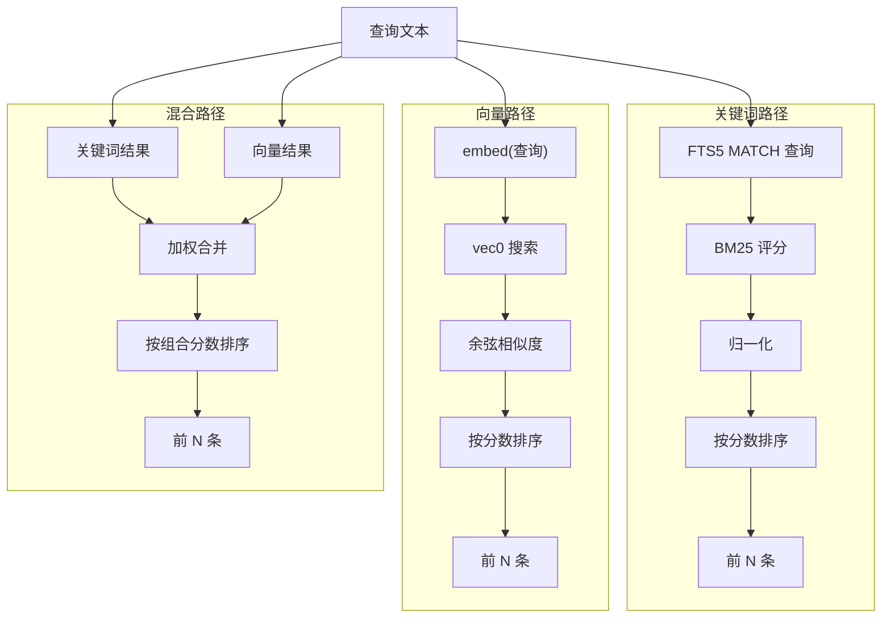
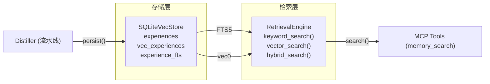
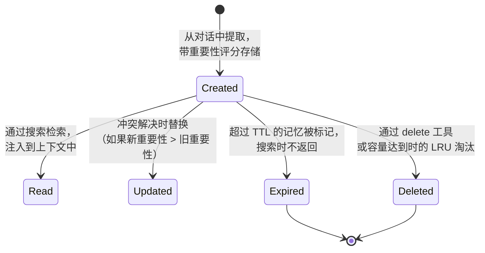

# 存储与检索

## 存储层

### SQLiteVecStore

**文件**: `src/store.rs`
**类型**: `SQLiteVecStore`

存储层构建在单个 SQLite 数据库文件之上，使用 **sqlite-vec**（用于向量搜索）和 **FTS5**（用于全文关键词搜索）。这消除了对独立向量数据库进程的需求。

#### 表结构

数据库使用三个核心表：

**`experiences`** — 主存储表：

```sql
CREATE TABLE IF NOT EXISTS experiences (
    id              TEXT PRIMARY KEY,
    tenant_id       TEXT NOT NULL DEFAULT 'default',
    content         TEXT NOT NULL,
    summary         TEXT NOT NULL DEFAULT '',
    memory_type     TEXT NOT NULL DEFAULT 'knowledge',
    importance      REAL NOT NULL DEFAULT 0.5,
    extraction_method TEXT NOT NULL DEFAULT 'direct',
    conversation_id TEXT NOT NULL DEFAULT '',
    metadata        TEXT NOT NULL DEFAULT '{}',
    source          TEXT NOT NULL DEFAULT 'conversation',
    created_at      TEXT NOT NULL,
    updated_at      TEXT NOT NULL
);
CREATE INDEX idx_experiences_tenant ON experiences(tenant_id);
CREATE INDEX idx_experiences_type ON experiences(memory_type);
```

**`vec_experiences`** — 用于向量搜索的虚拟表（仅在 `vector_dim > 0` 时创建）：

```sql
CREATE VIRTUAL TABLE IF NOT EXISTS vec_experiences USING vec0(
    id TEXT PRIMARY KEY,
    embedding float[dimension]
);
```

**`experience_fts`** — 用于关键词搜索的 FTS5 虚拟表：

```sql
CREATE VIRTUAL TABLE IF NOT EXISTS experience_fts USING fts5(
    content, summary,
    tokenize='unicode61'
);
```

#### ExperienceRepository Trait

```rust
#[async_trait]
pub trait ExperienceRepository: Send + Sync {
    async fn create(&self, exp: &Experience) -> Result<()>;
    async fn get(&self, id: &str) -> Result<Option<Experience>>;
    async fn update(&self, exp: &Experience) -> Result<()>;
    async fn delete(&self, id: &str) -> Result<()>;
    async fn delete_batch(&self, ids: &[String]) -> Result<()>;
    async fn search_by_vector(&self, ...) -> Result<Vec<(Experience, f64)>>;
    async fn search_by_keyword(&self, ...) -> Result<Vec<(Experience, f64)>>;
    async fn get_by_memory_type(&self, ...) -> Result<Vec<Experience>>;
    async fn count_by_memory_type(&self, tenant_id: &str, memory_type: MemoryType) -> Result<i64>;
    async fn count_for_tenant(&self, tenant_id: &str) -> Result<i64>;
    async fn counts_by_type(&self, tenant_id: &str) -> Result<Vec<(MemoryType, i64)>>;
}
```

### 线程安全

存储层包装在 `Arc<Mutex<Connection>>` 中——单个 SQLite 连接加上一个 tokio 互斥锁。这提供了：

- **安全的并发访问**，来自多个异步任务
- **串行化写入**（SQLite 天然的写入串行化）
- **共享读取**，通过单个连接

**注意**：对于非常高的吞吐量，考虑切换到 `r2d2` 连接池并启用 WAL 模式。

## 检索引擎

**文件**: `src/retrieval.rs`
**类型**: `RetrievalEngine`

### 检索模式

| 模式 | 描述 | 评分公式 |
|---|---|---|
| `keyword` | FTS5 全文搜索 + BM25 评分 | `0.7 × BM25 + 0.3 × importance` |
| `vector` | 与存储向量进行余弦相似度比较 | `cosine_similarity(query_vec, memory_vec)` |
| `hybrid` | 两者的加权组合 | `0.6 × 语义 + 0.2 × BM25 + 0.2 × importance` |

### BM25 评分器

BM25 是现代搜索引擎使用的标准概率检索函数。实现在 `src/retrieval.rs` 中：

```rust
pub(crate) fn bm25_score(query_terms: &[String], document: &str) -> f64
```

**参数**：
- `k1 = 1.2` — 词频饱和度因子
- `b = 0.75` — 长度归一化（标准 BM25）

**归一化**：原始 BM25 分数使用 `tanh(raw_score / 2.0)` 归一化到 `[0, 1]` 范围，以产生一致的、可比较的分数。

**分词**：FTS5 的 `unicode61` 分词器，加上 `tokenize()` 中的轻量预处理层，将文本转为小写、按空白/标点分割，并过滤英文停用词。

### 搜索流水线



### 过滤

所有检索模式都支持：

| 过滤项 | 描述 |
|---|---|
| `tenant_id` | 结果始终限定在租户范围内 |
| `memory_type` | 可选——限制为单一记忆类型 |
| `limit` | 最大结果数（默认：配置的 `retrieval_limit`，通常为 10） |

### 租户隔离

每个查询都通过 `tenant_id` 限定范围。对租户 `"alice"` 的搜索**永远不会**返回租户 `"bob"` 的记忆。这在 SQL 层面执行（`WHERE tenant_id = ?`）。

## 集成：存储 ↔ 检索



## 性能考量

| 方面 | 关键词模式 | 向量模式 | 混合模式 |
|---|---|---|---|
| **延迟** | ~1-5ms | ~10-50ms（含嵌入调用） | ~15-60ms |
| **API 成本** | $0 | 每次嵌入调用付费 | 每次嵌入调用付费 |
| **磁盘空间** | 极小（每条 ~1KB） | 每条 ~2KB（含向量） | 每条 ~2KB |
| **冷启动** | 即时 | 需要嵌入服务 | 需要嵌入服务 |
| **英文召回** | 良好（FTS5 + BM25） | 优秀 | 优秀 |
| **跨语言** | 弱 | 良好 | 良好 |

## 数据生命周期


